<div align="center">


<br><br>

# 🐾 M A N U S C L A W

### _Bangladesh's First Ultimate Autonomous AI Agent Framework_

**Unleash self-reasoning CLI beasts to execute code, browse the web, and dominate tasks — across 12+ messaging channels, with voice wake, live canvas, SSH control, and multi-agent routing. No limits. Pure power.**

<p>
  <b>Built by</b>
  <a href="https://github.com/The-JDdev">
    
  </a>
  &nbsp;•&nbsp;
  
  &nbsp;•&nbsp;
  
  &nbsp;•&nbsp;
  
</p>

---

<br>

```
     /\___/\
    (  o o  )   ◈ Autonomous AI Agent Framework v5.0.0
    (  =^=  )   ◈ 10+ LLM Providers  •  14 Built-in Tools
     (     )    ◈ 12+ Messaging Channels  •  Voice Wake & Talk
      \___/     ◈ Live Canvas (A2UI)  •  SSH Remote Gateway
                ◈ Multi-Agent Routing  •  Webhooks & Gmail
                ◈ 3 Sandbox Backends   •  Companion Apps
                ◈ Jailbreak-Resistant  •  Production-Grade
```

</div>

---

## 🎬 Table of Contents

- [🔥 What is ManusClaw?](#-what-is-manusclaw)
- [🆕 What's New in v5.0.0](#-whats-new-in-v500)
- [🧠 Core Philosophy & Design Principles](#-core-philosophy--design-principles)
- [🏗️ System Architecture](#️-system-architecture)
  - [Execution Model: The PAORR Loop](#-execution-model-the-paorr-loop)
  - [Agent Inheritance Chain](#-agent-inheritance-chain)
  - [System Architecture Layers](#-system-architecture-layers)
- [🧬 Deep Dive: How ManusClaw Works Under the Hood](#-deep-dive-how-manusclaw-works-under-the-hood)
  - [Agent Lifecycle](#-agent-lifecycle)
  - [Tool Intelligence Layer](#-tool-intelligence-layer)
  - [Memory Architecture](#-memory-architecture)
  - [Credential Pool & Token Budget](#-credential-pool--token-budget)
  - [Model Failover Profiles](#-model-failover-profiles)
  - [Identity Guard & Security](#-identity-guard--security)
  - [Permission Gate System](#-permission-gate-system)
  - [PlanningFlow Engine](#-planningflow-engine)
  - [Multi-Agent Orchestrator & Routing](#-multi-agent-orchestrator--routing)
  - [Skill Engine](#-skill-engine)
  - [MCP Protocol Integration](#-mcp-protocol-integration)
- [📨 12+ Messaging Channels](#-12-messaging-channels)
  - [Channel Architecture](#-channel-architecture)
  - [Supported Platforms](#-supported-platforms)
  - [WebChat — Built-in Web Client](#-webchat--built-in-web-client)
- [🎤 Voice Wake & Talk Mode](#-voice-wake--talk-mode)
  - [Wake Word Detection](#-wake-word-detection)
  - [Talk Mode](#-talk-mode)
  - [Text-to-Speech](#-text-to-speech)
- [🎨 Live Canvas (A2UI)](#-live-canvas-a2ui)
  - [Agent-to-UI Protocol](#-agent-to-ui-protocol)
  - [Canvas Server & Tool](#-canvas-server--tool)
  - [Mobile Canvas Nodes](#-mobile-canvas-nodes)
- [🖥️ Companion Apps](#-companion-apps)
  - [Desktop GUI (Flet)](#-desktop-gui-flet)
  - [macOS Menu Bar](#-macos-menu-bar)
  - [Windows System Tray Hub](#-windows-system-tray-hub)
  - [Mobile Node Client](#-mobile-node-client)
- [🪝 Webhooks (Incoming)](#-webhooks-incoming)
- [📧 Gmail Pub/Sub Automation](#-gmail-pubsub-automation)
- [🔑 SSH Remote Gateway Control](#-ssh-remote-gateway-control)
- [🐛 Sandbox Backends](#-sandbox-backends)
- [🛠️ The 14 Built-in Tools](#️-the-14-built-in-tools)
- [🔌 Supported LLM Providers](#-supported-llm-providers)
- [📁 Comprehensive Repository Breakdown](#-comprehensive-repository-breakdown)
  - [Root Configuration & Entry Points](#-root-configuration--entry-points)
  - [Core Application (`app/`)](#-core-application-app)
  - [Agent System (`app/agent/`)](#-agent-system-appagent)
  - [LLM System (`app/llm/`)](#-llm-system-appllm)
  - [Tool System (`app/tool/`)](#-tool-system-apptool)
  - [Memory System (`app/memory/`)](#-memory-system-appmemory)
  - [Persistence (`app/db/`)](#-persistence-appdb)
  - [Server (`app/server/`)](#-server-appserver)
  - [PlanningFlow (`app/flow/`)](#-planningflow-appflow)
  - [Permissions (`app/permissions/`)](#-permissions-apppermissions)
  - [MCP Integration (`app/mcp/`)](#-mcp-integration-appmcp)
  - [Messaging (`app/messaging/`)](#-messaging-appmessaging)
  - [Voice (`app/voice/`)](#-voice-appvoice)
  - [Canvas (`app/canvas/`)](#-canvas-appcanvas)
  - [SSH (`app/ssh/`)](#-ssh-appssh)
  - [Sandbox (`app/sandbox/`)](#-sandbox-appsandbox)
  - [Nodes (`app/nodes/`)](#-nodes-appnodes)
  - [Automation (`app/automation/`)](#-automation-appautomation)
  - [Desktop (`app/desktop/` + `desktop/`)](#-desktop-appdesktop--desktop)
  - [Skills (`app/skills/`)](#-skills-appskills)
  - [Provider Configs (`providers/`)](#-provider-configs-providers)
  - [Tests (`tests/`)](#-tests-tests)
  - [Documentation (`docs/`)](#-documentation-docs)
- [🚀 Entry Points & Execution Modes](#-entry-points--execution-modes)
- [⚙️ Setup & Installation](#️-setup--installation)
- [🎨 CLI Features](#-cli-features)
- [📋 Configuration System](#-configuration-system)
- [🔌 API Server Endpoints](#-api-server-endpoints)
- [🧪 Testing](#-testing)
- [📞 Connect with the Developer](#-connect-with-the-developer)
- [💎 Support the Project](#-support-the-project)
- [📜 License](#-license)

---

<br>

## 🔥 What is ManusClaw?

> **ManusClaw is not just another chatbot wrapper. It is a production-grade, fully autonomous AI agent framework designed for CLI-first, server-ready, multi-channel operation — built for developers who demand raw, unbridled power.**

ManusClaw empowers a Large Language Model (OpenAI, Anthropic, Google Gemini, Mistral, Ollama, AWS Bedrock, Groq, or any OpenAI-compatible endpoint) to **autonomously plan**, **execute code**, **browse the web**, **manage files**, **deploy to platforms**, and **complete complex multi-step tasks** — across **12+ messaging channels**, with **voice interaction**, **live UI canvas**, **SSH remote control**, **webhook automation**, and **Gmail integration**. It features a sophisticated **PAORR reasoning loop** (Plan -> Act -> Observe -> Reflect -> Retry), a **14-tool arsenal**, **persistent cross-session memory**, **multi-agent orchestration with per-channel routing**, **model failover profiles**, and an ironclad **identity guard** that resists jailbreaks and prompt injection attacks.

### Why ManusClaw?

| Challenge | ManusClaw Solution |
|---|---|
| **Vendor Lock-in** | 10+ LLM providers with automatic credential rotation, model failover profiles, and zero-switch routing |
| **No Persistence** | SQLite-backed sessions, task queues, memory, cron, webhooks — all survive restarts |
| **Static Prompts** | Skill Engine auto-injects domain expertise from YAML/Markdown skill files |
| **Security Blind Spots** | Identity Guard (30+ anti-jailbreak patterns), Permission Gate, Secret Redaction, HMAC webhook verification |
| **Single-Agent Limit** | DAG-based Multi-Agent Orchestrator with per-channel/per-account routing |
| **Tool Chaos** | Heuristic ToolSelector scores 16+ tools per step with failure penalties and recency diversification |
| **Platform Fragmentation** | Cross-platform: Linux, macOS, Windows, Termux/Android, Docker, Desktop (Flet), macOS menubar, Windows tray, Mobile |
| **Single-Channel** | 12+ messaging adapters: Telegram, Discord, Slack, WhatsApp, Signal, Teams, Matrix, IRC, Twitch, WebChat, Email, Google Chat |
| **No Voice Interface** | Wake word detection (pvporcupine/STT), Talk Mode (mic->STT->agent->TTS), 3 TTS backends |
| **No Visual Output** | Live Canvas A2UI protocol with real-time WebSocket updates, charts, tables, buttons |
| **No Remote Access** | Full SSH server with restricted shell, command whitelisting, public key auth |
| **Manual Triggers Only** | HMAC-verified webhooks, Gmail Pub/Sub automation, enhanced cron with channel output |

<br>

## 🆕 What's New in v5.0.0

ManusClaw v5.0.0 is a massive upgrade integrating 14 major feature categories inspired by OpenClaw, adding **9,636+ lines of new code** across 41 new files, with **210 tests passing**.

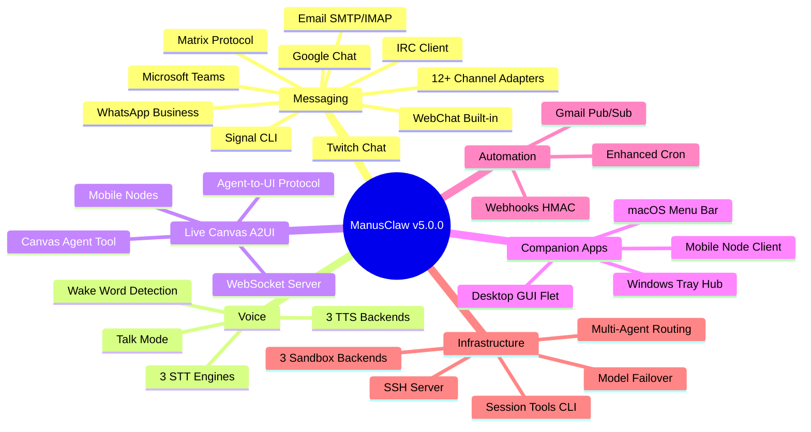

| Feature | Files | Lines | Status |
|---|---|---|---|
| **12+ Messaging Channels** | 11 | 1,153 | 8 functional + 3 stubs |
| **Voice Wake & Talk** | 4 | 966 | 3 TTS + 3 STT backends |
| **Live Canvas (A2UI)** | 4 | 1,012 | Full protocol + server + tool |
| **SSH Remote Gateway** | 3 | 800 | Full server + restricted shell |
| **Webhooks (Incoming)** | 2 | 709 | HMAC-SHA256 + SQLite |
| **Sandbox Backends** | 3 | 684 | Docker + SSH + OpenShell |
| **Nodes (Mobile/Desktop)** | 3 | 901 | Protocol + manager + client |
| **Gmail Automation** | 3 | 926 | Watcher + email tool |
| **Agent Routing** | 1 | 419 | Per-channel routing + LRU |
| **Model Failover** | 1 | 369 | Cross-provider rotation |
| **Session CLI** | 1 | 318 | 6 management commands |
| **Companion Apps** | 4 | 1,339 | Flet + macOS + Win + Mobile |

<br>

## 🧠 Core Philosophy & Design Principles

```
╔══════════════════════════════════════════════════════════════════╗
║                   MANUSCLAW v5.0 DESIGN PILLARS                  ║
╠══════════════════════════════════════════════════════════════════╣
║                                                                    ║
║   🎯 AUTONOMY FIRST    — Agents decide, act, and iterate alone    ║
║   🔒 SECURITY BY DEFAULT — Identity guard, permission gates,      ║
║                             HMAC webhooks, sandboxed execution   ║
║   🧩 EXTENSIBILITY        — Skills, MCP, custom roles, providers  ║
║   🌐 OMNICHANNEL          — 12+ messaging platforms, voice, canvas  ║
║   💾 PERSISTENCE EVERYWHERE — Sessions, memory, tasks, cron        ║
║   ⚡ ZERO-CONFIG SAFE      — Works with MockLLM out of the box     ║
║   🔄 RESILIENT             — Model failover, credential rotation   ║
║   🖥️ MULTI-INTERFACE      — CLI, Server, MCP, SSH, Desktop, Mobile ║
║   🔁 SELF-IMPROVING       — Reflection, retry, loop detection      ║
║                                                                    ║
╚══════════════════════════════════════════════════════════════════╝
```

ManusClaw was engineered from the ground up with a singular obsession: **give developers a CLI-native AI agent that genuinely thinks, acts, and learns — not one that merely generates text.** Every component, from the tool selector's heuristic scoring to the session database's WAL-mode SQLite, is designed for **production workloads** where reliability, security, and extensibility aren't optional — they're foundational.

The v5.0.0 release represents a quantum leap in capability. ManusClaw now operates as a true **omnichannel AI platform** — your agents live on Telegram, Discord, Slack, WhatsApp, Signal, Teams, Matrix, IRC, Twitch, and a built-in WebChat client. You can wake them with your voice, see them render live UIs through the A2UI canvas protocol, control them remotely via SSH, trigger them through HMAC-verified webhooks, automate email workflows through Gmail Pub/Sub, and monitor everything through native companion apps on macOS, Windows, and mobile devices. The framework's resilience is unmatched: model failover profiles automatically switch between LLM providers when one fails, credential rotation ensures continuous availability, and three sandbox backends (Docker, SSH, OpenShell) provide flexible isolation for code execution.

---

<br>

## 🏗️ System Architecture

### ⚙️ Execution Model: The PAORR Loop

Every agent in ManusClaw follows a powerful **five-phase reasoning loop** — not the simple "prompt -> response" pattern found in basic chatbots. This loop enables true autonomous task completion:

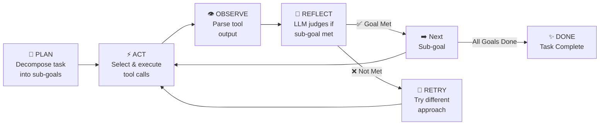

| Phase | Description | Implementation |
|---|---|---|
| **PLAN** | Decomposes the overarching goal into actionable sub-goals using LLM reasoning | TaskHistory tracking, Planning tool |
| **ACT** | Scores tools via heuristic signals, executes the highest-confidence tool calls | ToolSelector (16+ signal maps), 4-attempt retry with backoff |
| **OBSERVE** | Captures raw tool output, formats it for LLM consumption | Observation objects in TaskHistory |
| **REFLECT** | LLM evaluates whether the sub-goal was achieved; scores 0.0-1.0 | ReActAgent reflection, PlanningFlow scoring |
| **RETRY** | On failure: re-scores tools with failure penalties, allows LLM self-correction | Exponential backoff, ToolSelector failure tracking |

<br>

### 🧬 Agent Inheritance Chain

ManusClaw's agent hierarchy is a carefully layered inheritance chain where each layer adds critical capabilities without rewriting the core loop:

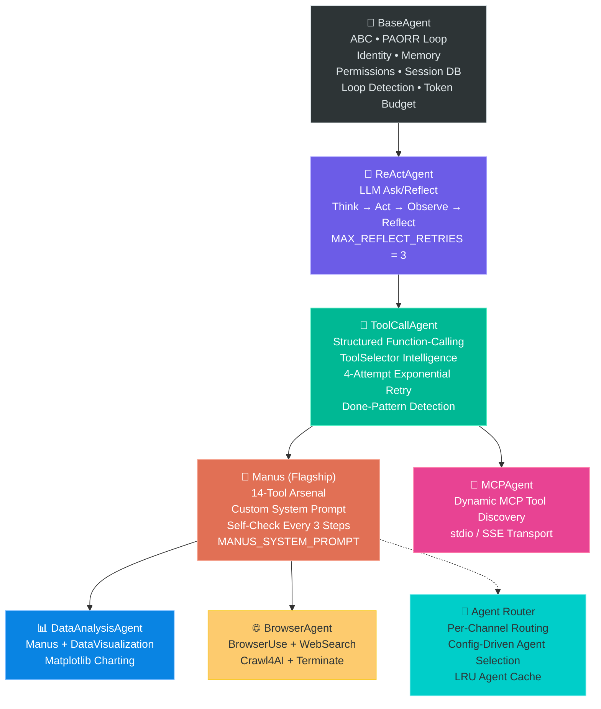

<br>

### 🏛️ System Architecture Layers

```
┌─────────────────────────────────────────────────────────────────────────────┐
│                              ENTRY POINTS                                     │
│  CLI Shell  •  HTTP/WS Server  •  MCP Client  •  Multi-Agent  •  Flow      │
│  Cron Scheduler  •  Single-Shot  •  SSH Server  •  Voice Wake  •  Desktop      │
│  WebChat  •  Webhook Receiver  •  Gmail Watcher  •  Session Tools CLI        │
└───────────────────────────────────┬─────────────────────────────────────────┘
                                    │
┌───────────────────────────────────▼─────────────────────────────────────────┐
│                          AGENT LAYER                                         │
│  BaseAgent → ReActAgent → ToolCallAgent → Manus                             │
│  MultiAgentOrchestrator  •  PlanningFlow  •  Role Pipeline                   │
│  AgentRouter (per-channel config-driven routing)                            │
└───┬───────┬───────┬───────┬───────┬───────┬───────┬───────┬───────┬────────┘
    │       │       │       │       │       │       │       │       │
┌───▼──┐ ┌──▼───┐ ┌▼────┐ ┌▼─────┐ ┌▼────┐ ┌▼────┐ ┌▼────┐ ┌▼────┐ ┌▼────┐
│ LLM  │ │ TOOL │ │ MEM │ │PERMS │ │ DB  │ │TASK │ │SKILL│ │IDENT │ │VOICE │
│Router│ │  14  │ │L+ST │ │ Gate │ │SQLite│ │Queue│ │ Eng │ │Guard│ │TTS   │
│10+Prv│ │Tools │ │FTS5 │ │ 3-T  │ │ WAL │ │Prior│ │ YAML│ │30+Pat│ │STT   │
│F/Ovr │ │A2UI  │ │     │ │      │ │     │ │     │ │     │ │      │ │Wake  │
└──────┘ └──────┘ └─────┘ └──────┘ └─────┘ └─────┘ └─────┘ └──────┘ └─────┘

┌─────────────────────────────────────────────────────────────────────────────┐
│                        INTEGRATION LAYER                                      │
│  12+ Messaging Channels  •  Webhooks (HMAC)  •  Gmail Pub/Sub                │
│  SSH Server  •  Canvas Server  •  Device Node Manager                       │
│  3 Sandbox Backends (Docker/SSH/OpenShell)  •  MCP Client/Server             │
└─────────────────────────────────────────────────────────────────────────────┘

┌─────────────────────────────────────────────────────────────────────────────┐
│                         COMPANION LAYER                                       │
│  Desktop GUI (Flet)  •  macOS Menu Bar (rumps)  •  Windows Tray (pystray)    │
│  Mobile Node Client (WebSocket)  •  WebChat Client                          │
└─────────────────────────────────────────────────────────────────────────────┘
```

<br>

---

<br>

## 🧬 Deep Dive: How ManusClaw Works Under the Hood

### 🔄 Agent Lifecycle

The Manus agent's lifecycle is a meticulously orchestrated sequence of initialization, reasoning, and cleanup. Here's what happens from the moment you type a command:

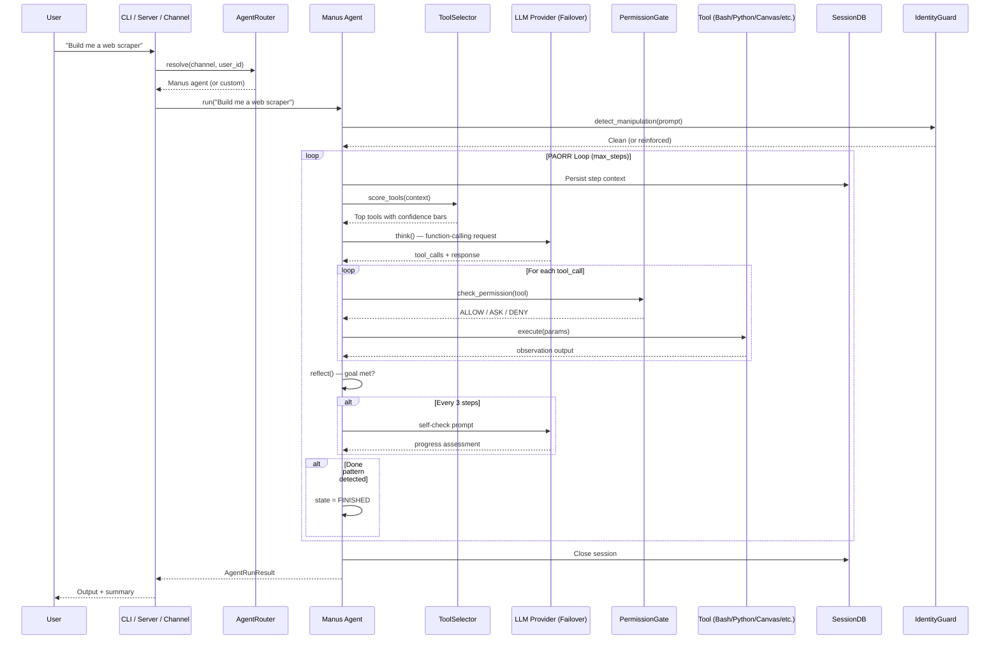

<br>

### 🎯 Tool Intelligence Layer

The **ToolSelector** (`app/tool/selector.py`) scores all 16+ available tools using a multi-signal heuristic engine:

| Signal | Mechanism |
|---|---|
| **Keyword Maps** | 16+ tools have curated keyword-weighted positive/negative signals |
| **Failure Penalties** | Tools that recently failed get -0.30 penalty per failure |
| **Recency Diversification** | Most-recently-used tool gets -0.10 penalty |
| **Visual Hint Injection** | Formatted ASCII box showing confidence bars for top 3 tools |
| **LLM Fallback Scoring** | Extra LLM call scores tools 0-100 when heuristics are ambiguous |

```
┌─────────────────────────────────────────┐
│         TOOL SELECTOR DECISION           │
├─────────────────────────────────────────┤
│  🟩 Bash          ████████░░  0.82      │
│  🟨 PythonExec    ██████░░░░  0.64      │
│  🟧 WebSearch     ████░░░░░░  0.42      │
│  🟦 Canvas        ███░░░░░░░  0.35      │
│  ⬜ BrowserUse    ██░░░░░░░░  0.21      │
└─────────────────────────────────────────┘
```

<br>

### 💾 Memory Architecture

ManusClaw features a **three-tier memory system** that persists across sessions:

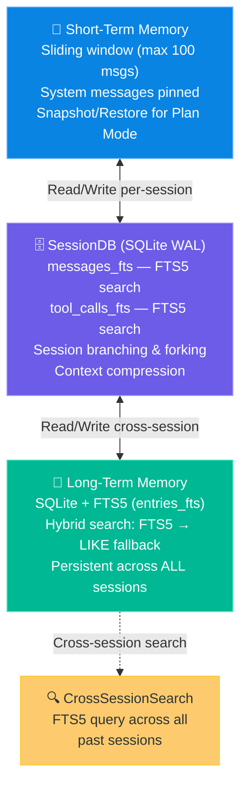

<br>

### 🔐 Credential Pool & Token Budget

#### Credential Pool (`app/llm/credential_pool.py`)

Multi-key rotation with 60-second cooldown, automatic failover on rate limits.

#### Model Failover Profiles (`app/llm/profile_rotation.py`) — **NEW in v5.0**

Cross-provider model failover with priority ordering, per-session profiles, and adaptive cooldown:

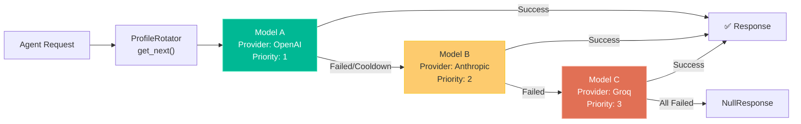

- **`ModelProfile`**: Ordered list of `ModelEntry` objects (provider, model, API key, priority, weights)
- **`ProfileRotator`**: `get_next()` returns the best available model; `mark_success()`/`mark_failed()` update stats
- **Adaptive cooldown**: Failed models enter exponential cooldown; successful calls reset stats
- **Per-session profiles**: Each session can have a custom model profile loaded from `config.yaml`
- **Config-driven**: Define profiles in `[model_profiles]` section of config

```yaml
# config.yaml — Model failover profile
model_profiles:
  default:
    - provider: openai
      model: gpt-4o
      priority: 1
    - provider: anthropic
      model: claude-sonnet-4-20250514
      priority: 2
    - provider: groq
      model: llama-3.3-70b-versatile
      priority: 3
```

<br>

### 🛡️ Identity Guard & Security

The **IdentityGuard** (`app/agent/identity_guard.py`) scans every user message for **30+ regex patterns** covering direct overrides, identity manipulation, DAN-style attacks, prompt extraction, and token boundary injection. Detected manipulation triggers message sanitization and identity reinforcement.

<br>

### 🔒 Permission Gate System

Three-tier permission model: ALLOW (auto-approved), ASK (requires approval in Plan Mode), DENY (hard-blocked). Per-session approval memory with catastrophic-operation blocking.

<br>

### 📐 PlanningFlow Engine

LLM-generated plans with step decomposition, success scoring (threshold 0.35), automatic replanning, agent caching, and DataAnalysisAgent routing.

<br>

### 🎭 Multi-Agent Orchestrator & Routing

#### Orchestrator (`app/agent/orchestrator.py`)

DAG-based pipeline using Kahn's algorithm, async parallel execution, event hooks:

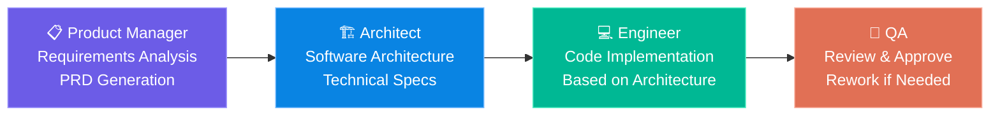

#### Agent Router (`app/agent/router.py`) — **NEW in v5.0**

Per-channel and per-account agent routing with config-driven rules and LRU caching:

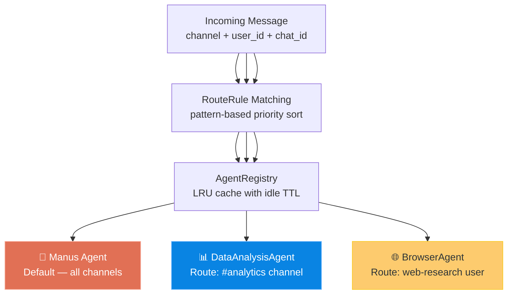

- **`RouteRule`**: Pattern-based routing (channel, user_id, chat_id -> agent_name) with priority ordering
- **`AgentRegistry`**: LRU cache with idle TTL to prevent agent proliferation
- **`AgentRouter`**: Loads from `[agents]` section in `config.yaml`, dynamically imports agent classes

```yaml
# config.yaml — Agent routing
agents:
  definitions:
    - name: manus
      class_path: app.agent.manus.Manus
    - name: data_analyst
      class_path: app.agent.data_analysis.DataAnalysisAgent
    - name: browser_agent
      class_path: app.agent.browser.BrowserAgent

  routes:
    - pattern: "channel:telegram"
      agent: manus
      priority: 1
    - pattern: "channel:discord,#analytics"
      agent: data_analyst
      priority: 2
    - pattern: "user_id:admin_user"
      agent: manus
      priority: 3
```

<br>

### 📚 Skill Engine

YAML-frontmatter Markdown skills with keyword-overlap scoring, 6 built-in skills (Coding, Data Analysis, DevOps, GitHub, MLOps, Research), auto-suggest creation after 5+ tool calls.

<br>

### 🔗 MCP Protocol Integration

Full **Model Context Protocol** citizen — JSON-RPC 2.0 client (stdio/SSE) and FastAPI-based server exposing local tools.

<br>

---

<br>

## 📨 12+ Messaging Channels

### 📡 Channel Architecture

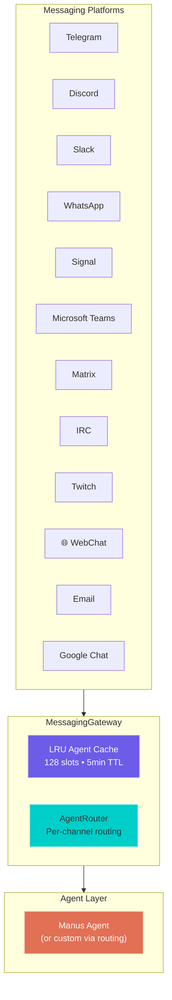

<br>

### 📋 Supported Platforms

| Platform | Adapter | Protocol | Status | Key Features |
|---|---|---|---|---|
| **Telegram** | `telegram.py` | Bot API | ✅ Functional | Bot API integration, commands |
| **Discord** | `discord.py` | Gateway | ✅ Functional | Server/channel messaging |
| **Slack** | `slack.py` | Web API | ✅ Functional | Workspace integration |
| **WhatsApp** | `whatsapp.py` | Business Cloud API | ✅ Functional | Webhook receive, API send |
| **Signal** | `signal.py` | signal-cli REST | ✅ Functional | Polling receive, group support |
| **Microsoft Teams** | `teams.py` | Bot Framework v3 | 🔧 Stub | OAuth pending |
| **Matrix** | `matrix.py` | Homeserver REST | ✅ Functional | Long-poll sync, event filtering |
| **IRC** | `irc.py` | Raw TCP | ✅ Functional | Pure async, PING keepalive |
| **Twitch** | `twitch.py` | IRC-over-TLS | ✅ Functional | OAuth auth, rate limiting |
| **WebChat** | `webchat.py` | WebSocket | ✅ Functional | Per-client queues, broadcast |
| **Email** | `email.py` | SMTP/IMAP | 🔧 Stub | SMTP send works, IMAP pending |
| **Google Chat** | `google_chat.py` | Chat API v1 | 🔧 Stub | Service account auth |

> **Stub Mode**: All adapters work in stub mode when credentials are missing, logging messages without connecting. Configure environment variables to activate.

### 🌐 WebChat — Built-in Web Client

The **WebChatAdapter** (`app/messaging/webchat.py`) provides a built-in WebSocket-based chat interface — always available, no external dependencies:

- **Per-client async queues** for isolated message streams
- `register_connection(session_id)` / `unregister_connection(session_id)`
- `receive_from_client(session_id)` — non-blocking message intake
- `broadcast(message)` — send to all connected clients
- Integrates seamlessly with the FastAPI server's WebSocket endpoint at `/ws/{session_id}`

---

<br>

## 🎤 Voice Wake & Talk Mode

### 🔊 Wake Word Detection (`app/voice/wake.py` — 319 lines)

Three-backend wake word detection system:

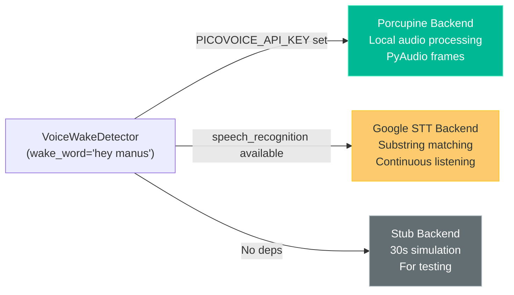

- **Porcupine backend**: Uses Picovoice's pvporcupine for ultra-low-latency local wake word detection via PyAudio frame processing
- **Google STT backend**: Falls back to `speech_recognition` library with continuous microphone input and substring matching
- **Stub backend**: Simulates wake detection after 30 seconds for CI/testing environments
- **Async design**: All backends run as async coroutines with clean start/stop lifecycle

```bash
manusclaw voice wake --start --word "hey manus" --sensitivity 0.7
```

### 🗣️ Talk Mode (`app/voice/talk.py` — 302 lines)

Continuous voice conversation loop: **microphone -> STT -> Agent -> TTS -> speakers**

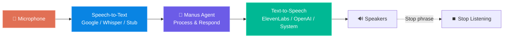

- **3 STT engines**: Google Web Speech API, OpenAI Whisper (local), stdin stub
- **Stop phrase detection**: "stop listening", "go to sleep", "goodbye" (case-insensitive)
- **Configurable TTS**: Automatically uses the best available TTS provider
- **Seamless integration**: Works with any ManusClaw agent instance

### 🔊 Text-to-Speech (`app/voice/tts.py` — 326 lines)

Hierarchical TTS provider system with automatic fallback:

| Provider | Backend | Quality | Network | Config |
|---|---|---|---|---|
| **ElevenLabsTTS** | ElevenLabs API | ⭐⭐⭐⭐⭐ | Required | `ELEVENLABS_API_KEY` |
| **OpenAITTS** | OpenAI TTS API | ⭐⭐⭐⭐ | Required | `OPENAI_API_KEY` |
| **SystemTTS** | pyttsx3 | ⭐⭐⭐ | Offline | Auto-detected |
| **NullTTS** | Silent logger | — | — | Fallback |

```bash
# Use with Groq for fast LLM + ElevenLabs for voice
GROQ_API_KEY=your-key ELEVENLABS_API_KEY=your-key manusclaw voice talk --start
```

---

<br>

## 🎨 Live Canvas (A2UI)

### 🖼️ Agent-to-UI Protocol (`app/canvas/a2ui.py` — 347 lines)

The A2UI (Agent-to-UI) protocol enables agents to render live, interactive UI components through a JSON-RPC-inspired dataclass system:

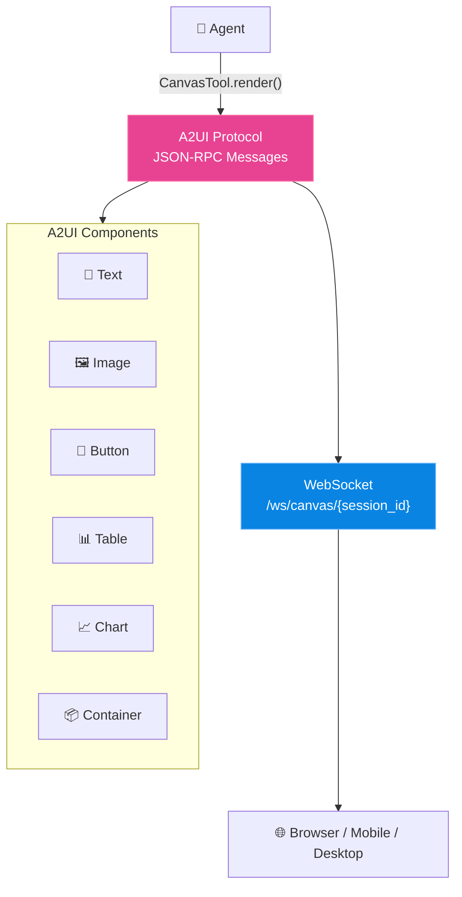

**Supported component types:**
- `TextComponent` — Rich text with markdown formatting
- `ImageComponent` — Embedded images (base64 or URL)
- `ButtonComponent` — Interactive buttons with callbacks
- `TableComponent` — Data tables with headers and rows
- `ChartComponent` — Charts (bar, line, pie, scatter, radar) with Chart.js-compatible datasets
- `ContainerComponent` — Layout containers (row, column, grid)

**Message types:** `CanvasUpdate`, `CanvasClear`, `CanvasSyncRequest`, `CanvasEvent`

### 🎨 Canvas Server & Tool

| Component | File | Lines | Purpose |
|---|---|---|---|
| **A2UI Protocol** | `a2ui.py` | 347 | Dataclass definitions, enums, serialization, builder helpers |
| **Canvas Server** | `server.py` | 333 | FastAPI WebSocket router, per-session state, multi-viewer broadcast |
| **Canvas Tool** | `tool.py` | 262 | Agent-callable `CanvasTool(BaseTool)` with render/add_chart/clear actions |

```python
# Agent usage via CanvasTool
await canvas_tool.execute({
    "action": "render",
    "component": {
        "type": "chart",
        "chart_type": "bar",
        "title": "Revenue by Quarter",
        "datasets": [{"label": "Revenue", "data": [120, 190, 300, 250]}]
    }
})
```

### 📱 Mobile Canvas Nodes

The **DeviceManager** (`app/nodes/manager.py` — 507 lines) enables mobile and desktop clients to connect as canvas rendering nodes:

- **Device registration** with capability advertising (screen, voice, camera)
- **Heartbeat monitoring** with automatic stale-node cleanup
- **Canvas push** — server pushes A2UI updates to connected nodes
- **Bidirectional communication** — nodes send events, server sends commands
- **Mobile Node Client** (`desktop/mobile/node_client.py` — 462 lines) with auto-OS detection, jitter backoff reconnection, voice forwarding, and screen capture

---

<br>

## 🖥️ Companion Apps

### 🖥️ Desktop GUI (Flet) — `app/desktop/main.py` (282 lines)

Cross-platform desktop application built with **Flet** (Flutter for Python):

- Dark-themed chat interface with message bubbles
- Status bar with agent state
- Collapsible settings panel (model, base_url, API key)
- Threaded agent execution via PlanningFlow
- Entry point: `manusclaw-desktop`

### 🍎 macOS Menu Bar — `desktop/macos/menubar.py` (333 lines)

Native macOS menu bar app using **rumps**:

- WebSocket client with exponential-backoff reconnection
- Periodic health checks to `/healthz`
- Menu: Status, Chat, Canvas, Quick Chat, Voice, Preferences, Quit
- Desktop notifications support
- Entry point: `manusclaw-menubar`

### 🪟 Windows System Tray Hub — `desktop/windows_hub/hub.py` (262 lines)

Windows system tray application using **pystray**:

- PIL-generated 64x64 tray icon
- WebSocket client with up to 50 retry attempts
- Desktop notifications via pystray
- Menu: Open Chat, Start Node, Settings, Exit
- Entry point: `manusclaw-hub`

### 📱 Mobile Node Client — `desktop/mobile/node_client.py` (462 lines)

Mobile WebSocket client for iOS/Android/Desktop:

- Auto-OS detection (iOS, Android, desktop)
- WebSocket connection with jitter backoff reconnection
- Device registration with capability advertisement
- Voice data forwarding (recording queue)
- Screen capture forwarding (frame queue)
- Bidirectional chat messaging
- Entry point: `manusclaw-node`

---

<br>

## 🪝 Webhooks (Incoming)

### HMAC-Verified Webhook System

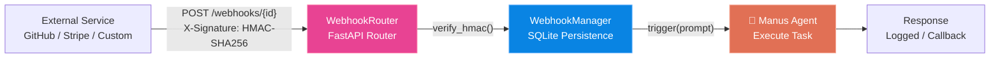

| Component | File | Lines | Purpose |
|---|---|---|---|
| **Webhook Router** | `server/webhook_router.py` | 223 | FastAPI routes: POST trigger, GET list, POST create, DELETE, GET sign |
| **Webhook Manager** | `server/webhooks.py` | 486 | SQLite persistence, HMAC-SHA256 verification, prompt template formatting |

**Key features:**
- **HMAC-SHA256 verification** on every incoming webhook
- **Template formatting**: `{{payload.field}}` interpolation in agent prompts
- **SQLite persistence**: Webhooks survive server restarts
- **CLI management**: `manusclaw-webhook create/list/delete/sign`

```bash
# Create a webhook for GitHub push events
manusclaw-webhook create --url "/webhooks/github-push" \
  --secret "my-webhook-secret" \
  --prompt "Analyze this GitHub push: {{payload.head_commit.message}}"

# Get signing helper
manusclaw-webhook sign --id github-push --payload '{"test": "data"}'
```

---

<br>

## 📧 Gmail Pub/Sub Automation

### GmailWatcher (`app/automation/gmail.py` — 486 lines)

Automated email processing pipeline:

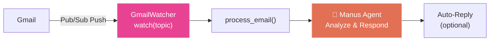

- **Pub/Sub push notifications** via Google Cloud Pub/Sub topic
- **Email processing pipeline**: Fetch -> Parse -> Agent -> Optional Auto-Reply
- **FastAPI webhook handler**: `create_webhook_handler()` returns a FastAPI endpoint for Pub/Sub push
- **Unread listing**: `list_unread()` for manual email polling

### EmailTool (`app/automation/email_tool.py` — 425 lines)

Agent-callable email operations tool:

| Action | Description |
|---|---|
| `send` | Send emails with MIME + base64 encoding via Gmail API |
| `read` | List emails by label (inbox, sent, drafts) |
| `search` | Full Gmail query syntax support |
| `reply` | Threaded replies with proper References headers |

---

<br>

## 🔑 SSH Remote Gateway Control

### SSH Server (`app/ssh_server.py` — 406 lines)

Full SSH server using **asyncssh** with public key authentication:

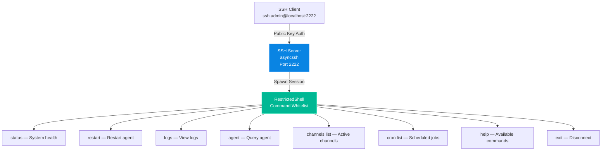

**Restricted Shell** (`app/ssh/shell.py` — 379 lines):
- **Whitelist-based**: Only 9 approved commands (status, restart, logs, agent, channels list, cron list, help, exit)
- **Input validation**: Rejects pipes, redirects, shell metacharacters, command chaining
- **Parse -> Validate -> Execute** pipeline with full audit logging

```bash
# Enable SSH server
MANUSCLAW_SSH_ENABLED=true \
MANUSCLAW_SSH_PORT=2222 \
MANUSCLAW_SSH_AUTH_KEYS=~/.ssh/authorized_keys \
manusclaw-ssh start
```

---

<br>

## 🐛 Sandbox Backends

Three sandbox backends for flexible code isolation:

| Backend | File | Lines | Transport | Use Case |
|---|---|---|---|---|
| **DockerSandbox** | `sandbox/docker.py` | 92 | Docker API (network=none) | Container isolation |
| **SshSandbox** | `sandbox/ssh.py` | 279 | asyncssh / paramiko | Remote execution on dedicated host |
| **OpenShellSandbox** | `sandbox/openshell.py` | 243 | Linux unshare (namespaces) | Lightweight namespace isolation |

**Sandbox Factory** (`app/sandbox/factory.py` — 162 lines):
- `create_sandbox(backend)` — Creates appropriate backend from config
- `list_available_backends()` — Detects which backends are available
- Config-driven: `SANDBOX_BACKEND` env var or `config.toml` `[sandbox]` section

```yaml
# config.toml
[sandbox]
enabled = true
backend = "docker"  # or "ssh", "openshell"
docker_image = "python:3.12-slim"
memory_limit = "2g"
timeout = 300

[ssh_sandbox]
host = "sandbox.example.com"
user = "manusclaw"
key_path = "~/.ssh/sandbox_key"
```

---

<br>

## 🛠️ The 14 Built-in Tools

| # | Tool | File | Description |
|---|---|---|---|
| 1 | 🐍 **PythonExecute** | `python_execute.py` | Isolated subprocess with 2GB memory rlimit |
| 2 | 💻 **Bash** | `bash.py` | Persistent cross-platform async shell |
| 3 | 🌐 **BrowserUse** | `browser_use_tool.py` | Playwright Chromium automation |
| 4 | 🔍 **WebSearch** | `web_search.py` | DuckDuckGo -> Bing fallback chain |
| 5 | 📄 **StrReplaceEditor** | `str_replace_editor.py` | File view/create/edit/undo |
| 6 | 📝 **MemoryTool** | `memory_tool.py` | MEMORY.md/USER.md CRUD |
| 7 | 🤖 **Delegate** | `delegate.py` | Spawns isolated subagent |
| 8 | 🖼️ **ImageGen** | `image_gen.py` | FAL.ai text-to-image |
| 9 | 📊 **DataVisualization** | `data_viz.py` | matplotlib/mpld3 charts |
| 10 | 🔎 **CrossSessionSearch** | `cross_session_search.py` | FTS5 cross-session search |
| 11 | 🛠️ **SkillManager** | `skill_manager.py` | Skill CRUD operations |
| 12 | 📋 **Planning** | `planning.py` | Task decomposition |
| 13 | ❓ **AskHuman** | `ask_human.py` | User clarification requests |
| 14 | 🚪 **Terminate** | `terminate.py` | Task completion signal |

> **Bonus tools:** Crawl4AI, NodeExecute, PlatformControl, CanvasTool, EmailTool

---

<br>

## 🔌 Supported LLM Providers

ManusClaw's **Universal LLM Router** routes to the right client automatically:

| Provider | Client | Transport | Notes |
|---|---|---|---|
| **MockLLM** | Built-in | None | Default safe fallback |
| **OpenAI** | Official SDK | Async | GPT-4o, GPT-4, o1, o3 |
| **Anthropic** | Official SDK | Messages API | Claude 3.5/4, extended thinking |
| **Google Gemini** | genai SDK | GenerateContent | Gemini Pro/Ultra |
| **Groq** | OpenAI-compat | REST | Llama, Mixtral — lightning fast |
| **Mistral AI** | Official SDK | Chat/completion | Mistral Large/Medium/Small |
| **AWS Bedrock** | boto3 | Converse API | Any Bedrock model |
| **Ollama** | Official SDK | Local HTTP | Any local model |
| **GGUF** | llama-cpp-python | Local | Fully offline |
| **HuggingFace** | Inference API | REST | Spaces + Endpoints |
| **Any OpenAI-compat** | UniversalClient | OpenAI format | OpenRouter, LMStudio, Together |

> **Adaptive Timeouts**: Deep-thinking models (DeepSeek R1, o1/o3, Claude extended thinking) automatically get extended timeouts.

---

<br>

## 📁 Comprehensive Repository Breakdown

### 🗂️ Root Configuration & Entry Points

| File | Purpose |
|---|---|
| `config.toml` | Default configuration: LLM provider, browser, sandbox, workspace, max steps |
| `.env.example` | 70+ environment variables template |
| `main.py` | Single-shot entry point |
| `run_server.py` | FastAPI/uvicorn server launcher |
| `run_flow.py` | PlanningFlow entry point |
| `run_multi_agent.py` | Multi-agent pipeline entry |
| `run_mcp.py` | MCP Client entry point |
| `run_mcp_server.py` | MCP Server entry point |
| `pyproject.toml` | v5.0.0 metadata, all dependencies, 7 CLI entry points |
| `requirements.txt` | Core + optional dependency lists |
| `Dockerfile` | Multi-stage build, Python 3.11, health check |
| `docker-compose.yml` | 3 service profiles: CLI, Server, Multi-Agent |

<br>

### 📦 Core Application (`app/`)

| File | Lines | Purpose |
|---|---|---|
| **`cli.py`** | 572 | Main CLI: Rich UI, 4 skins, 12 slash commands, task queue |
| **`config.py`** | 322 | Thread-safe singleton Config with 7-level priority chain |
| **`schema.py`** | 512 | All Pydantic models: Role, AgentState, Message, ToolCall, Plan, etc. |
| **`logger.py`** | 200 | Context-aware logger with gzip rotation, TRACE level |
| **`exceptions.py`** | 195 | Exception hierarchy: ManusClawError -> LLM/Tool/Config/Sandbox/MCP/Agent |
| **`cron.py`** | 235 | CronScheduler: YAML-persisted, channel output delivery, webhook triggers |
| **`multi_agent.py`** | 50 | Multi-agent CLI with build/plan mode |
| **`task_queue.py`** | 399 | Persistent task queue: QUEUED -> RUNNING -> PAUSED -> COMPLETED/FAILED |
| **`session_tools.py`** | 318 | **NEW** Session CLI: list, history, send, spawn, delete, export |

<br>

### 🤖 Agent System (`app/agent/`)

| File | Lines | Purpose |
|---|---|---|
| **`base.py`** | 399 | BaseAgent ABC: PAORR loop, identity, memory, permissions |
| **`react.py`** | 187 | ReActAgent: LLM ask, think/act/observe/reflect |
| **`toolcall.py`** | 331 | ToolCallAgent: Function-calling, 4-attempt retry |
| **`manus.py`** | 180 | Manus (Flagship): 14 tools, self-check every 3 steps |
| **`orchestrator.py`** | 281 | DAG multi-agent: Kahn's algorithm, parallel execution |
| **`router.py`** | 419 | **NEW** Per-channel agent routing with LRU cache |
| **`identity_guard.py`** | 117 | 30+ anti-jailbreak regex patterns |
| **`browser.py`** | 32 | BrowserAgent: BrowserUse + WebSearch + Crawl4AI |
| **`data_analysis.py`** | 60 | DataAnalysisAgent: Manus + DataVisualization |
| **`mcp.py`** | 81 | MCPAgent: Dynamic MCP tool discovery |

<br>

### 🧠 LLM System (`app/llm/`)

| File | Lines | Purpose |
|---|---|---|
| **`llm.py`** | 702 | Universal LLM Router: 10+ providers, credential rotation |
| **`credential_pool.py`** | 123 | Multi-key rotation, 60s cooldown |
| **`profile_rotation.py`** | 369 | **NEW** Cross-provider model failover with cooldown |
| **`token_tracker.py`** | 131 | Per-session tracking, grace call, cost estimation |
| **`secret_redaction.py`** | 42 | API key scrubbing from logs |
| **`bedrock_client.py`** | 86 | AWS Bedrock Converse API |
| **`mistral_client.py`** | 64 | Mistral AI SDK wrapper |
| **`offline_router.py`** | 330 | GGUF, Ollama, OpenAI-compat, HuggingFace |

<br>

### 🔧 Tool System (`app/tool/`) — 18 tools

18 tool files totaling 1,600+ lines. Includes base, selector (heuristic scoring), bash, python_execute, browser_use_tool, str_replace_editor, web_search, memory_tool, delegate, terminate, ask_human, planning, image_gen, data_viz, cross_session_search, skill_manager, crawl4ai, node_execute, platform_control.

<br>

### 📨 Messaging (`app/messaging/`) — 12 adapters

| File | Lines | Purpose |
|---|---|---|
| **`base.py`** | 44 | ABC + IncomingMessage dataclass |
| **`__init__.py`** | 47 | Exports all 12 adapters + CLI helper |
| **`gateway.py`** | 80 | LRU agent cache (128 slots, 5min TTL) |
| **`telegram.py`** | 57 | Telegram Bot API |
| **`discord.py`** | 40 | Discord Gateway |
| **`slack.py`** | 39 | Slack Web API |
| **`whatsapp.py`** | 112 | **NEW** WhatsApp Business Cloud API |
| **`signal.py`** | 117 | **NEW** Signal via signal-cli REST |
| **`google_chat.py`** | 72 | **NEW** Google Chat (stub) |
| **`teams.py`** | 72 | **NEW** Microsoft Teams (stub) |
| **`matrix.py`** | 131 | **NEW** Matrix Homeserver REST |
| **`irc.py`** | 163 | **NEW** Pure async IRC client |
| **`twitch.py`** | 140 | **NEW** Twitch IRC-over-TLS |
| **`webchat.py`** | 86 | **NEW** Built-in WebSocket chat |
| **`email.py`** | 82 | **NEW** Email SMTP/IMAP (stub) |

<br>

### 🎤 Voice (`app/voice/`) — NEW in v5.0

| File | Lines | Purpose |
|---|---|---|
| **`tts.py`** | 326 | TTS hierarchy: SystemTTS, OpenAITTS, ElevenLabsTTS, NullTTS |
| **`wake.py`** | 319 | Wake word: Porcupine, Google STT, stub backends |
| **`talk.py`** | 302 | Talk Mode: mic -> STT -> agent -> TTS loop |
| **`__init__.py`** | 19 | Package exports |

<br>

### 🎨 Canvas (`app/canvas/`) — NEW in v5.0

| File | Lines | Purpose |
|---|---|---|
| **`a2ui.py`** | 347 | A2UI protocol: component types, events, serialization |
| **`server.py`** | 333 | WebSocket canvas server with per-session state |
| **`tool.py`** | 262 | Agent-callable CanvasTool (render, chart, clear) |
| **`__init__.py`** | 70 | Package exports + helpers |

<br>

### 🔑 SSH (`app/ssh/` + `app/ssh_server.py`) — NEW in v5.0

| File | Lines | Purpose |
|---|---|---|
| **`ssh_server.py`** | 406 | Full asyncssh SSH server with pub key auth |
| **`shell.py`** | 379 | Restricted shell: 9 whitelisted commands |
| **`__init__.py`** | 15 | Package exports |

<br>

### 🪝 Webhooks (`app/server/`) — NEW in v5.0

| File | Lines | Purpose |
|---|---|---|
| **`webhook_router.py`** | 223 | FastAPI routes with HMAC verification |
| **`webhooks.py`** | 486 | SQLite persistence, template formatting, agent trigger |

<br>

### 🐛 Sandbox (`app/sandbox/`) — Enhanced in v5.0

| File | Lines | Purpose |
|---|---|---|
| **`docker.py`** | 92 | Docker container isolation |
| **`ssh.py`** | 279 | **NEW** Remote execution via asyncssh/paramiko |
| **`openshell.py`** | 243 | **NEW** Linux namespace isolation via unshare |
| **`factory.py`** | 162 | **NEW** Backend selection factory |

<br>

### 📱 Nodes (`app/nodes/`) — NEW in v5.0

| File | Lines | Purpose |
|---|---|---|
| **`protocol.py`** | 336 | Wire protocol: device types, events, serialization |
| **`manager.py`** | 507 | Device manager: registration, heartbeat, canvas push |
| **`__init__.py`** | 58 | Package exports |

<br>

### 📧 Automation (`app/automation/`) — NEW in v5.0

| File | Lines | Purpose |
|---|---|---|
| **`gmail.py`** | 486 | Gmail Pub/Sub watcher with auto-reply |
| **`email_tool.py`** | 425 | Agent email tool: send/read/search/reply |
| **`__init__.py`** | 15 | Package exports |

<br>

### 🖥️ Desktop (`app/desktop/` + `desktop/`) — Enhanced in v5.0

| File | Lines | Purpose |
|---|---|---|
| **`app/desktop/main.py`** | 282 | Flet desktop GUI |
| **`desktop/macos/menubar.py`** | 333 | **NEW** macOS menu bar (rumps) |
| **`desktop/windows_hub/hub.py`** | 262 | **NEW** Windows system tray (pystray) |
| **`desktop/mobile/node_client.py`** | 462 | **NEW** Mobile WebSocket node client |

<br>

### 🧪 Tests (`tests/`) — 22 test files

| File | Purpose |
|---|---|
| `conftest.py` | Shared pytest fixtures |
| `test_agent_loop.py` | Agent PAORR loop execution |
| `test_agent_router.py` | Agent routing logic |
| `test_canvas.py` | **NEW** Canvas A2UI protocol |
| `test_credential_pool.py` | Credential rotation pool |
| `test_credential_rotation.py` | Multi-key rotation behavior |
| `test_cron.py` | Cron scheduling |
| `test_cron_enhanced.py` | **NEW** Enhanced cron features |
| `test_messaging.py` | Telegram/Discord/Slack adapters |
| `test_messaging_channels.py` | **NEW** All 12+ channel adapters |
| `test_nodes.py` | **NEW** Device node protocol + manager |
| `test_paorr.py` | PAORR execution model |
| `test_profile_rotation.py` | **NEW** Model failover profiles |
| `test_sandbox.py` | **NEW** Docker/SSH/OpenShell backends |
| `test_session_db.py` | SessionDB persistence |
| `test_session_tools.py` | **NEW** Session CLI commands |
| `test_skills.py` | SkillEngine loading/scoring |
| `test_ssh.py` | **NEW** SSH server + restricted shell |
| `test_tool_dispatch.py` | Tool dispatch and execution |
| `test_voice.py` | **NEW** TTS providers + wake detection |
| `test_webhooks.py` | **NEW** Webhook HMAC + management |

---

<br>

## 🚀 Entry Points & Execution Modes

| Mode | Command | Description |
|---|---|---|
| 🖥️ **Interactive CLI** | `manusclaw` | Persistent AI shell with slash commands, 4 Rich skins |
| ⚡ **Single-Shot CLI** | `manusclaw "your task"` | Single Manus run |
| 🌐 **HTTP/WS Server** | `manusclaw-server` | FastAPI + WebSocket on port 8765 |
| 📐 **PlanningFlow** | `python run_flow.py "goal"` | Plan -> dispatch -> score -> replan |
| 🎭 **Multi-Agent** | `manusclaw-multi "goal"` | PM -> Architect -> Engineer -> QA pipeline |
| 🔗 **MCP Client** | `python run_mcp.py` | Connect to remote MCP servers |
| 🖧 **MCP Server** | `python run_mcp_server.py` | Expose tools via MCP protocol |
| ⏰ **Cron Scheduler** | `manusclaw-cron --run` | Scheduled execution with channel output |
| 🔧 **Session Tools** | `manusclaw-sessions` | **NEW** list/history/send/spawn/delete/export |
| 📨 **Channel Manager** | `manusclaw-channels` | **NEW** Start/stop messaging channels |
| 🪝 **Webhook CLI** | `manusclaw-webhook` | **NEW** create/list/delete/sign webhooks |
| 🎤 **Voice Wake** | `manusclaw voice wake --start` | **NEW** Start wake word detection |
| 🗣️ **Voice Talk** | `manusclaw voice talk --start` | **NEW** Start voice conversation mode |
| 🔑 **SSH Server** | `manusclaw-ssh start` | **NEW** Start SSH remote gateway |

---

<br>

## ⚙️ Setup & Installation

> ### ⚙️ **ManusClaw Setup:** To install and set up the environment, please use the official setup repository:
> ### 🔗 [https://github.com/The-JDdev/manusclaw-setup](https://github.com/The-JDdev/manusclaw-setup)

<details>
<summary><b>📁 System Requirements</b></summary>

| Requirement | Minimum | Recommended |
|---|---|---|
| **Python** | 3.11+ | 3.12+ |
| **OS** | Linux, macOS, Windows, Termux | Linux (Ubuntu 22.04+) |
| **RAM** | 2 GB | 4 GB+ |
| **Disk** | 500 MB | 1 GB+ |
| **Docker** (optional) | 20.10+ | Latest |
| **Node.js** (optional) | 18+ | 20 LTS |

</details>

<details>
<summary><b>⚡ Quick Install</b></summary>

### Core Install

```bash
git clone https://github.com/The-JDdev/manusclaw.git
cd manusclaw
chmod +x install.sh
./install.sh
```

### Install with All v5.0 Features

```bash
pip install -e ".[all-plus]"
```

### Feature-Specific Installs

```bash
# Voice (wake word + TTS)
pip install -e ".[voice]"

# SSH server + remote sandbox
pip install -e ".[ssh]"

# Gmail automation
pip install -e ".[gmail]"

# Matrix messaging
pip install -e ".[matrix]"

# Companion apps (macOS menubar, Windows tray)
pip install -e ".[companion]"
```

### From PyPI

```bash
pip install manusclaw
pip install manusclaw[all-plus]  # Everything
```

</details>

<details>
<summary><b>🐳 Docker Deployment</b></summary>

```bash
# Server mode (port 8765)
docker compose --profile server up -d

# CLI mode
docker compose --profile cli run manusclaw "your task here"

# Multi-Agent mode
docker compose --profile multi-agent run manusclaw-multi "your goal here"
```

</details>

<details>
<summary><b>🔑 Environment Configuration</b></summary>

```bash
cp .env.example .env
```

```bash
# ── LLM Providers ──────────────────────
OPENAI_API_KEY=sk-your-key-here
ANTHROPIC_API_KEY=sk-ant-your-key-here
GOOGLE_API_KEY=your-key-here
GROQ_API_KEY=gsk_your-key-here     # Lightning-fast inference

# Multiple keys (auto-rotating)
OPENAI_API_KEY=sk-primary
OPENAI_API_KEY_2=sk-secondary

# ── Messaging Channels ────────────────
TELEGRAM_BOT_TOKEN=your-token
DISCORD_BOT_TOKEN=your-token
SLACK_BOT_TOKEN=your-token
WHATSAPP_ACCESS_TOKEN=your-token
WHATSAPP_BUSINESS_PHONE_ID=your-id
SIGNAL_CLI_REST_URL=http://localhost:8080
SIGNAL_CLI_NUMBER=+1234567890
MATRIX_HOMESERVER=https://matrix.org
MATRIX_ACCESS_TOKEN=your-token
MATRIX_USER_ID=@bot:matrix.org
IRC_SERVER=irc.libera.chat
IRC_PORT=6697
IRC_NICK=manusclaw-bot
IRC_CHANNELS=#manusclaw
TWITCH_BOT_TOKEN=oauth:your-token
TWITCH_CHANNEL=your-channel

# ── Voice ─────────────────────────────
PICOVOICE_API_KEY=your-key       # Porcupine wake word
ELEVENLABS_API_KEY=your-key      # ElevenLabs TTS

# ── SSH Server ───────────────────────
MANUSCLAW_SSH_ENABLED=true
MANUSCLAW_SSH_PORT=2222
MANUSCLAW_SSH_AUTH_KEYS=~/.ssh/authorized_keys

# ── Gmail ────────────────────────────
GOOGLE_APPLICATION_CREDENTIALS=/path/to/service-account.json

# ── Server ───────────────────────────
MANUSCLAW_API_KEY=your-secret-key
MANUSCLAW_SERVER_HOST=0.0.0.0
MANUSCLAW_SERVER_PORT=8765
```

> **💡 No API key? No problem.** ManusClaw defaults to MockLLM — works immediately without any configuration.

</details>

---

<br>

## 🎨 CLI Features

```
┌─────────────────────────────────────────────────────────┐
│  🐾 ManusClaw v5.0.0  │  Skin: default  │  Steps: 0/50  │
├─────────────────────────────────────────────────────────┤
│  🎯 Build Mode — Tools auto-approved                    │
│  📋 Plan Mode  — Tools require approval                  │
│                                                          │
│  /model    — Switch LLM model/provider                  │
│  /skills   — List & manage skills                       │
│  /tools    — Show available tools                        │
│  /memory   — View/manage agent memory                   │
│  /compress — Compress conversation context               │
│  /new      — Start fresh session                        │
│  /resume   — Resume previous session                    │
│  /branch   — Fork current session branch                │
│  /tasks    — Manage task queue                          │
│  /bg       — Run task in background                     │
│  /voice    — Toggle voice mode                          │
│  /channels — Channel management                        │
│  /help     — Show all commands                          │
│  /exit     — Exit ManusClaw                             │
└─────────────────────────────────────────────────────────┘
```

---

<br>

## 📋 Configuration System

```
┌─────────────────────────────────────────────┐
│  🔴 1. Environment Variables               │
│  🟠 2. Profile .env                        │
│  🟡 3. Profile config.yaml                 │
│  🟢 4. Global .env                          │
│  🔵 5. Global config.yaml                   │
│  🟣 6. Local config.toml                    │
│  ⚪ 7. Built-in Defaults (MockLLM)         │
└─────────────────────────────────────────────┘
```

<details>
<summary><b>📖 v5.0 Configuration Sections</b></summary>

| Section | Key Settings |
|---|---|
| `[llm]` | provider, model, base_url, api_key, max_tokens, temperature |
| `[model_profiles]` | **NEW** failover profiles with priority ordering |
| `[agents]` | **NEW** agent definitions and routing rules |
| `[browser]` | headless, disable_security, max_content_length |
| `[sandbox]` | enabled, backend (docker/ssh/openshell), docker_image |
| `[ssh_sandbox]` | **NEW** host, user, key_path for remote sandbox |
| `[voice]` | **NEW** wake_word, sensitivity, tts_provider, stt_engine |
| `[ssh_server]` | **NEW** enabled, port, host_key, auth_keys |
| `[channels]` | **NEW** per-channel enable flags and tokens |
| `[webhooks]` | **NEW** secret, persistence path |
| `[gmail]` | **NEW** credentials, watch_topic, auto_reply |
| `[cron]` | enhanced with channel output and webhook triggers |
| `[logging]` | level, json_format, include_trace, redact_secrets |
| `[skins]` | active, border_color |

</details>

---

<br>

## 🔌 API Server Endpoints

| Method | Endpoint | Description |
|---|---|---|
| `GET` | `/healthz` | Health check |
| `POST` | `/run` | Execute agent task asynchronously |
| `POST` | `/run/sync` | Execute agent task synchronously |
| `GET` | `/sessions` | List all sessions |
| `GET` | `/sessions/{id}/messages` | Get session messages |
| `GET` | `/sessions/{id}/tool_calls` | Get tool call history |
| `GET` | `/tools` | List all tools with schemas |
| `POST` | `/multi-agent` | Run multi-agent pipeline |
| `WS` | `/ws/{session_id}` | Real-time streaming WebSocket |
| `WS` | `/ws/canvas/{session_id}` | **NEW** Live Canvas A2UI |
| `POST` | `/webhooks/create` | **NEW** Create incoming webhook |
| `GET` | `/webhooks` | **NEW** List all webhooks |
| `POST` | `/webhooks/{hook_id}` | **NEW** Trigger webhook (HMAC verified) |
| `DELETE` | `/webhooks/{hook_id}` | **NEW** Delete webhook |
| `GET` | `/webhooks/sign/{hook_id}` | **NEW** HMAC signature helper |

---

<br>

## 🧪 Testing

```bash
# Run all 210 tests
pytest

# Verbose with full output
pytest -v

# Parallel (4 workers)
pytest -n 4

# Specific test suites
pytest tests/test_voice.py tests/test_canvas.py tests/test_ssh.py
pytest tests/test_messaging_channels.py tests/test_webhooks.py
pytest tests/test_nodes.py tests/test_session_tools.py
```

| Test Suite | Tests | Coverage |
|---|---|---|
| `test_agent_loop.py` | PAORR loop, state transitions |
| `test_agent_router.py` | Per-channel agent routing |
| `test_canvas.py` | A2UI protocol, server, tool |
| `test_credential_pool.py` | Credential rotation, cooldown |
| `test_credential_rotation.py` | Multi-key behavior |
| `test_cron.py` | Cron scheduling, YAML persistence |
| `test_cron_enhanced.py` | Enhanced cron with channels |
| `test_messaging.py` | Telegram/Discord/Slack |
| `test_messaging_channels.py` | All 12+ channel adapters |
| `test_nodes.py` | Device protocol + manager |
| `test_paorr.py` | Plan/Act/Observe/Reflect/Retry |
| `test_profile_rotation.py` | Model failover profiles |
| `test_sandbox.py` | Docker/SSH/OpenShell backends |
| `test_session_db.py` | SQLite persistence, FTS5 |
| `test_session_tools.py` | Session CLI commands |
| `test_skills.py` | SkillEngine loading/scoring |
| `test_ssh.py` | SSH server + restricted shell |
| `test_tool_dispatch.py` | Tool execution, retry |
| `test_voice.py` | TTS providers, wake detection |
| `test_webhooks.py` | HMAC verification, management |

> **✅ All 210 tests passing, 2 skipped** — Production ready.

---

<br>

## 📞 Connect with the Developer

<div align="center">

<table>
<tr>
<td align="center">
<a href="https://facebook.com/itsshsshobuj">

</a>
</td>
<td align="center">
<a href="https://t.me/singularityos">

</a>
</td>
<td align="center">
<a href="mailto:thejddev.official@gmail.com">

</a>
</td>
</tr>
</table>

<br>


</div>

---

<br>

## 💎 Support the Project

> If ManusClaw has empowered your workflow, consider supporting its continued development. Every contribution fuels the next evolution of autonomous AI agents.

<br>

### 💰 Crypto & Digital Wallets

#### 💲 Webmoney — WMZ (USD)
```
Z430378899900
```

#### 💲 Webmoney — WMT (Tether)
```
T202226490170
```

#### 💲 USDT (TRC20 — Tron Network)
```
TH75J4zaMPwhyR3QxEFdwTCgU2Pp3yPUEr
```

#### 📱 Bkash (Mobile Banking — Bangladesh)
```
01310211442
```

<br>

---

<br>

## 📜 License

This project is licensed under the **Modified MIT License**.


### Summary

| Use Case | Credit Required? | Conditions |
|---|---|---|
| **Personal / Educational / Open-Source** | No | Free to use, modify, distribute without attribution |
| **Internal / Non-Commercial** | No | Free for organizations for non-revenue purposes |
| **Commercial / SaaS / Productized** | **Yes** | Must credit "ManusClaw, created by The-JDdev (SHS Lab)" prominently |
| **Name / Trademark Use** | **Written permission required** | Cannot use "ManusClaw", "The-JDdev", or "SHS Lab" to market derived products |

See the [LICENSE](LICENSE) file in the repository for the full legal text.

---

<div align="center">

```
  ██╗      ██████╗  ██████╗ ██████╗ ███████╗
  ██║     ██╔════╝ ██╔═══██╗██╔══██╗██╔════╝
  ██║     ██║  ███╗██║   ██║██████╔╝███████╗
  ██║     ██║   ██║██║   ██║██╔═══╝ ╚════██║
  ███████╗╚██████╔╝╚██████╔╝██║     ███████║
  ╚══════╝ ╚═════╝  ╚═════╝ ╚═╝     ╚══════╝
              Claws of Intelligence
```

**Made with 🐾 by [The-JDdev](https://github.com/The-JDdev) • SHS Lab**

</div>
