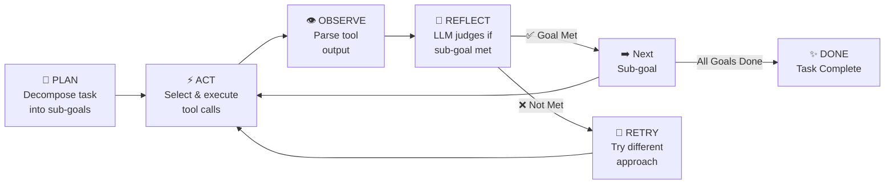
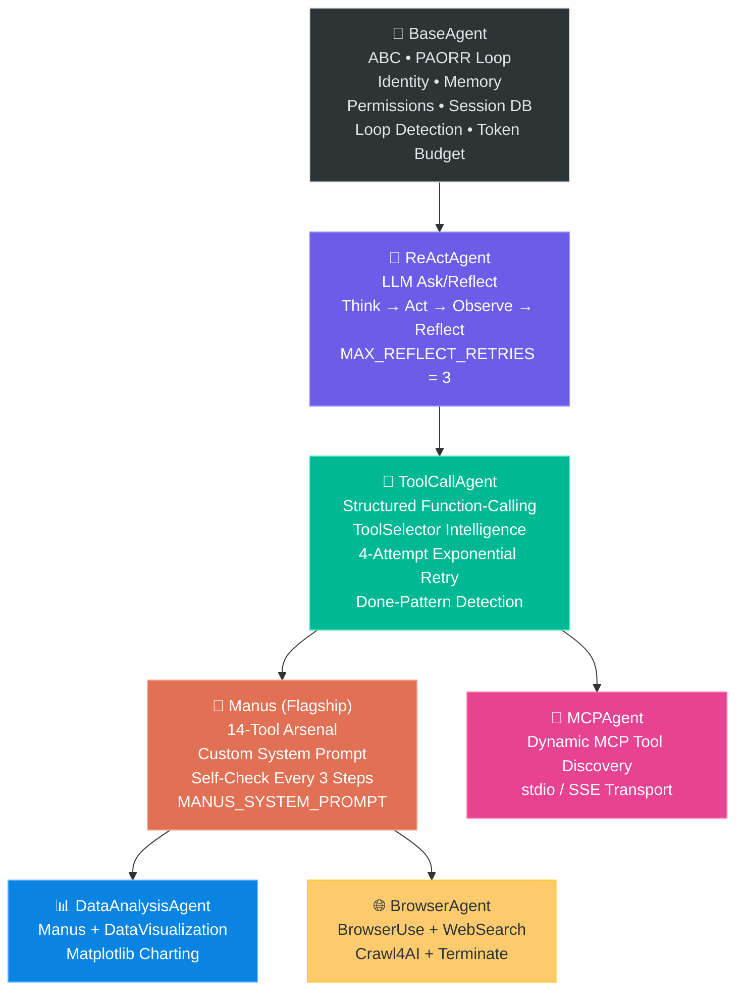
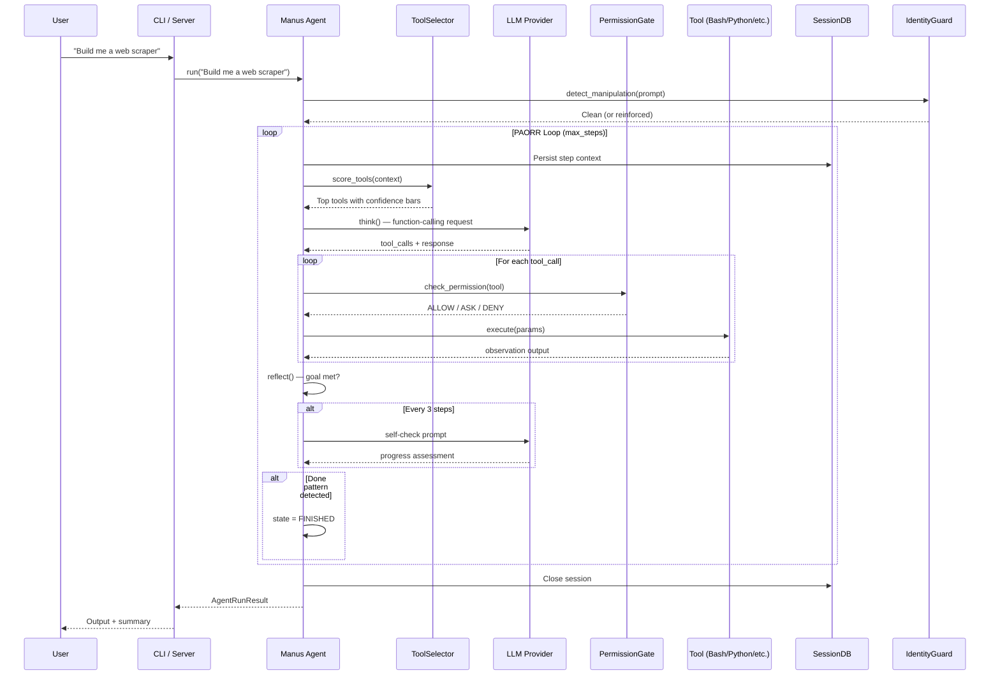
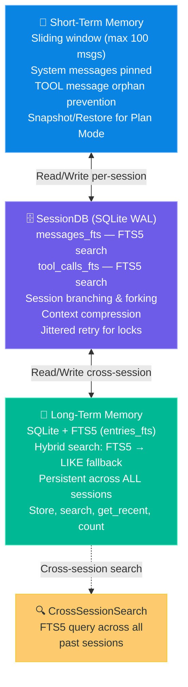
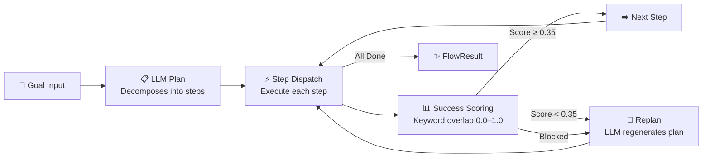
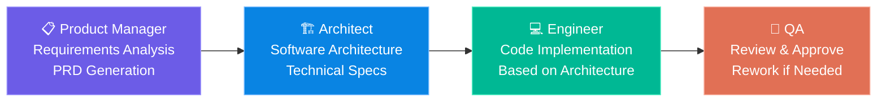

<div align="center">


<br><br>

# 🐾 M A N U S C L A W

### _Bangladesh's First Ultimate Autonomous AI Agent Framework_

**Unleash self-reasoning CLI beasts to execute code, browse the web, and dominate tasks without limits. No GUIs. Pure power.**

<p>
  <b>Built by</b>
  <a href="https://github.com/The-JDdev">
    
  </a>
  &nbsp;•&nbsp;
  
  &nbsp;•&nbsp;
  
</p>

---

<br>

```
     /\___/\
    (  o o  )   ◈ Autonomous AI Agent Framework
    (  =^=  )   ◈ 10+ LLM Providers  •  14 Built-in Tools
     (     )    ◈ Multi-Agent Orchestration  •  Persistent Memory
      \___/     ◈ Jailbreak-Resistant  •  Production-Grade
```

</div>

---

## 🎬 Table of Contents

- [🔥 What is ManusClaw?](#-what-is-manusclaw)
- [🧠 Core Philosophy & Design Principles](#-core-philosophy--design-principles)
- [🏗️ System Architecture](#️-system-architecture)
  - [Execution Model: The PAORR Loop](#-execution-model-the-paorr-loop)
  - [Agent Inheritance Chain](#-agent-inheritance-chain)
  - [System Architecture Layers](#-system-architecture-layers)
- [🧬 Deep Dive: How ManusClaw Works Under the Hood](#-deep-dive-how-manusclaw-works-under-the-hood)
  - [Agent Lifecycle](#-agent-lifecycle)
  - [Tool Intelligence Layer](#-tool-intelligence-layer)
  - [Memory Architecture](#-memory-architecture)
  - [Credential Pool & Token Budget](#-credential-pool--token-budget)
  - [Identity Guard & Security](#-identity-guard--security)
  - [Permission Gate System](#-permission-gate-system)
  - [PlanningFlow Engine](#-planningflow-engine)
  - [Multi-Agent Orchestrator](#-multi-agent-orchestrator)
  - [Skill Engine](#-skill-engine)
  - [MCP Protocol Integration](#-mcp-protocol-integration)
  - [Messaging Gateway](#-messaging-gateway)
- [🛠️ The 14 Built-in Tools](#️-the-14-built-in-tools)
- [🔌 Supported LLM Providers](#-supported-llm-providers)
- [📁 Comprehensive Repository Breakdown](#-comprehensive-repository-breakdown)
  - [Root Configuration & Entry Points](#-root-configuration--entry-points)
  - [Core Application (`app/`)](#-core-application-app)
  - [Agent System (`app/agent/`)](#-agent-system-appagent)
  - [LLM System (`app/llm/`)](#-llm-system-appllm)
  - [Tool System (`app/tool/`)](#-tool-system-apptool)
  - [Memory System (`app/memory/`)](#-memory-system-appmemory)
  - [Persistence (`app/db/`)](#-persistence-appdb)
  - [Server (`app/server/`)](#-server-appserver)
  - [PlanningFlow (`app/flow/`)](#-planningflow-appflow)
  - [Permissions (`app/permissions/`)](#-permissions-apppermissions)
  - [MCP Integration (`app/mcp/`)](#-mcp-integration-appmcp)
  - [Messaging (`app/messaging/`)](#-messaging-appmessaging)
  - [Skills (`app/skills/`)](#-skills-appskills)
  - [Sandbox (`app/sandbox/`)](#-sandbox-appsandbox)
  - [Desktop (`app/desktop/`)](#-desktop-appdesktop)
  - [Provider Configs (`providers/`)](#-provider-configs-providers)
  - [Tests (`tests/`)](#-tests-tests)
  - [Documentation (`docs/`)](#-documentation-docs)
- [🚀 Entry Points & Execution Modes](#-entry-points--execution-modes)
- [⚙️ Setup & Installation](#️-setup--installation)
  - [System Requirements](#system-requirements)
  - [Quick Install](#quick-install)
  - [Docker Deployment](#docker-deployment)
- [🎨 CLI Features](#-cli-features)
- [📋 Configuration System](#-configuration-system)
- [🔌 API Server Endpoints](#-api-server-endpoints)
- [🧪 Testing](#-testing)
- [📞 Connect with the Developer](#-connect-with-the-developer)
- [💎 Support the Project](#-support-the-project)
- [📜 License](#-license)

---

<br>

## 🔥 What is ManusClaw?

> **ManusClaw is not just another chatbot wrapper. It is a production-grade, fully autonomous AI agent framework designed for CLI-first, server-ready operation — built for developers who demand raw, unbridled power.**

ManusClaw empowers a Large Language Model (OpenAI, Anthropic, Google Gemini, Mistral, Ollama, AWS Bedrock, or any OpenAI-compatible endpoint) to **autonomously plan**, **execute code**, **browse the web**, **manage files**, **deploy to platforms**, and **complete complex multi-step tasks** — all without human intervention. It features a sophisticated **PAORR reasoning loop** (Plan → Act → Observe → Reflect → Retry), a **14-tool arsenal**, **persistent cross-session memory**, **multi-agent orchestration**, and an ironclad **identity guard** that resists jailbreaks and prompt injection attacks.

### Why ManusClaw?

| Challenge | ManusClaw Solution |
|---|---|
| **Vendor Lock-in** | 10+ LLM providers with automatic credential rotation and zero-switch routing |
| **No Persistence** | SQLite-backed sessions, task queues, memory, and cron — all survive restarts |
| **Static Prompts** | Skill Engine auto-injects domain expertise from YAML/Markdown skill files |
| **Security Blind Spots** | Identity Guard (30+ anti-jailbreak patterns), Permission Gate, Secret Redaction |
| **Single-Agent Limit** | DAG-based Multi-Agent Orchestrator (PM → Architect → Engineer → QA pipeline) |
| **Tool Chaos** | Heuristic ToolSelector scores 16+ tools per step with failure penalties and recency diversification |
| **Platform Fragmentation** | Cross-platform: Linux, macOS, Windows, Termux/Android, Docker, and Desktop (Tauri) |

<br>

## 🧠 Core Philosophy & Design Principles

```
╔══════════════════════════════════════════════════════════════════╗
║                     MANUSCLAW DESIGN PILLARS                     ║
╠══════════════════════════════════════════════════════════════════╣
║                                                                    ║
║   🎯 AUTONOMY FIRST    — Agents decide, act, and iterate alone    ║
║   🔒 SECURITY BY DEFAULT — Identity guard, permission gates,      ║
║                             sandboxed execution                   ║
║   🧩 EXTENSIBILITY        — Skills, MCP, custom roles, providers   ║
║   💾 PERSISTENCE EVERYWHERE — Sessions, memory, tasks, cron        ║
║   ⚡ ZERO-CONFIG SAFE      — Works with MockLLM out of the box      ║
║   🌐 MULTI-INTERFACE      — CLI, Server, MCP, Cron, Desktop        ║
║   🔁 SELF-IMPROVING       — Reflection, retry, loop detection      ║
║                                                                    ║
╚══════════════════════════════════════════════════════════════════╝
```

ManusClaw was engineered from the ground up with a singular obsession: **give developers a CLI-native AI agent that genuinely thinks, acts, and learns — not one that merely generates text.** Every component, from the tool selector's heuristic scoring to the session database's WAL-mode SQLite, is designed for **production workloads** where reliability, security, and extensibility aren't optional — they're foundational.

The framework operates on a fundamental belief: the best AI agent is the one you don't need to babysit. ManusClaw agents decompose goals into executable plans, select the right tools with intelligence scoring, execute with retry logic that includes exponential backoff and LLM self-correction, and persist everything to disk so no work is ever lost. Whether you're running a single-shot code generation task, orchestrating a four-role software development pipeline, or scheduling automated cron jobs across messaging platforms, ManusClaw handles it all from a single, unified framework.

---

<br>

## 🏗️ System Architecture

### ⚙️ Execution Model: The PAORR Loop

Every agent in ManusClaw follows a powerful **five-phase reasoning loop** — not the simple "prompt → response" pattern found in basic chatbots. This loop enables true autonomous task completion:



| Phase | Description | Implementation |
|---|---|---|
| **PLAN** | Decomposes the overarching goal into actionable sub-goals using LLM reasoning | TaskHistory tracking, Planning tool |
| **ACT** | Scores tools via heuristic signals, executes the highest-confidence tool calls | ToolSelector (16+ signal maps), 4-attempt retry with backoff |
| **OBSERVE** | Captures raw tool output, formats it for LLM consumption | Observation objects in TaskHistory |
| **REFLECT** | LLM evaluates whether the sub-goal was achieved; scores 0.0–1.0 | ReActAgent reflection, PlanningFlow scoring |
| **RETRY** | On failure: re-scores tools with failure penalties, allows LLM self-correction | Exponential backoff, ToolSelector failure tracking |

<br>

### 🧬 Agent Inheritance Chain

ManusClaw's agent hierarchy is a carefully layered inheritance chain where each layer adds critical capabilities without rewriting the core loop:



<br>

### 🏛️ System Architecture Layers

```
┌─────────────────────────────────────────────────────────────────────────┐
│                         ENTRY POINTS                                    │
│   CLI Shell  •  HTTP/WS Server  •  MCP Client  •  Multi-Agent  •  Flow  │
│   Cron Scheduler  •  Single-Shot  •  Desktop (Tauri)                     │
└───────────────────────────────┬─────────────────────────────────────────┘
                                │
┌───────────────────────────────▼─────────────────────────────────────────┐
│                       AGENT LAYER                                       │
│   BaseAgent → ReActAgent → ToolCallAgent → Manus                       │
│   MultiAgentOrchestrator  •  PlanningFlow  •  Role Pipeline              │
└───┬───────┬───────┬───────┬───────┬───────┬───────┬───────┬────────────┘
    │       │       │       │       │       │       │       │
┌───▼──┐ ┌──▼───┐ ┌▼────┐ ┌▼─────┐ ┌▼────┐ ┌▼────┐ ┌▼────┐ ┌▼──────┐
│ LLM  │ │ TOOL │ │MEM  │ │PERMS │ │ DB  │ │TASK │ │SKILL│ │IDENT  │
│Router│ │  14  │ │ L+ST│ │ Gate │ │SQLite│ │Queue│ │Eng  │ │Guard  │
│10+Prv│ │Tools │ │FTS5 │ │ 3-T  │ │ WAL │ │Prior│ │YAML │ │30+Pat │
└──────┘ └──────┘ └─────┘ └──────┘ └─────┘ └─────┘ └─────┘ └───────┘
```

Each layer communicates through well-defined interfaces. The **Agent Layer** orchestrates everything, delegating to specialized subsystems. The **LLM Router** supports ten-plus providers with automatic credential rotation. The **Tool Layer** includes heuristic intelligence that scores tools before the LLM even decides. The **Memory Layer** combines short-term sliding windows with persistent long-term SQLite+FTS5 storage. Every tool call passes through the **Permission Gate**, and every user message is screened by the **Identity Guard**.

---

<br>

## 🧬 Deep Dive: How ManusClaw Works Under the Hood

### 🔄 Agent Lifecycle

The Manus agent's lifecycle is a meticulously orchestrated sequence of initialization, reasoning, and cleanup. Here's what happens from the moment you type a command:



**Step-by-step breakdown:**

1. **Instantiation** — Creates workspace directory, registers all 14 tools in a `ToolCollection`, initializes the `ToolSelector`, and calls `super().__init__()` through the full MRO chain (Manus → ToolCallAgent → ReActAgent → BaseAgent), setting up state, memory, permission gate, session DB, trace_id, and max_steps.

2. **`run(prompt)`** — Sets state to `RUNNING`, creates a `TaskHistory`, sets log context (trace_id, agent_name, step=0), injects the MANUSCLAW_IDENTITY system prompt, injects up to 2 relevant skills from the `SkillEngine`, runs the identity guard on the user prompt, adds the sanitized message, and creates/resumes a session in SessionDB.

3. **Main Loop** — While `RUNNING` and step count < max_steps: checks token budget, injects `TaskHistory` context every 5 steps, and calls `agent.step()`.

4. **`step()`** — The ToolSelector scores all tools and injects a visual confidence hint into the prompt. The LLM receives the context and returns structured function-calling responses. Each tool call passes through the PermissionGate, gets executed with up to 4 retry attempts (exponential backoff + LLM self-correction on errors), and results are recorded as observations. A self-check prompt is injected every 3 steps.

5. **Loop Detection** — Duplicate response detection (exact + 80% similarity over 3 messages) and tool-call loop detection (same tool failing 3 consecutive steps) both inject nudge messages to break cycles.

6. **Cleanup** — Closes the session in DB, cleans up tools (closes Bash subprocess, etc.), cancels pending DB tasks, and resets log context.

<br>

### 🎯 Tool Intelligence Layer

The **ToolSelector** (`app/tool/selector.py`) is one of ManusClaw's most sophisticated subsystems. Before every LLM decision, it scores all 16+ available tools using a multi-signal heuristic engine:

| Signal | Mechanism |
|---|---|
| **Keyword Maps** | 16+ tools have curated keyword-weighted positive/negative signals. "python", "code", "script" boost PythonExecute; "browse", "click", "url" boost BrowserUse |
| **Failure Penalties** | Tools that recently failed get -0.30 penalty per failure, discouraging repeated mistakes |
| **Recency Diversification** | The most-recently-used tool gets -0.10 penalty, encouraging the agent to explore different tools |
| **Visual Hint Injection** | A formatted ASCII box showing confidence bars for the top 3 tools is injected into the LLM prompt |
| **LLM Fallback Scoring** (optional) | An extra LLM call can score tools 0–100, used as a fallback when heuristic scores are ambiguous |

```
┌─────────────────────────────────────────┐
│         TOOL SELECTOR DECISION           │
├─────────────────────────────────────────┤
│  🟩 Bash          ████████░░  0.82      │
│  🟨 PythonExec    ██████░░░░  0.64      │
│  🟧 WebSearch     ████░░░░░░  0.42      │
│  ⬜ BrowserUse    ██░░░░░░░░  0.21      │
│  ⬜ FileEdit      ░░░░░░░░░░  0.08      │
└─────────────────────────────────────────┘
```

<br>

### 💾 Memory Architecture

ManusClaw features a **three-tier memory system** that persists across sessions and enables powerful cross-session reasoning:



- **ShortTermMemory** maintains a sliding window of the most recent messages (up to 100), with system messages always pinned to the top and TOOL messages kept as orphan-safe records. It supports snapshot and restore for Plan Mode context switching.
- **SessionDB** uses SQLite in WAL (Write-Ahead Logging) mode with FTS5 virtual tables for lightning-fast full-text search across all messages and tool calls. It supports session branching (fork a session from any point), context compression for long conversations, and jittered retries for concurrent access.
- **LongTermMemory** provides persistent storage that survives across all sessions. Uses a hybrid search strategy: FTS5 full-text search first, then LIKE fallback for broader matching. This enables the agent to recall information from tasks completed days or weeks ago.

<br>

### 🔐 Credential Pool & Token Budget

#### Credential Pool (`app/llm/credential_pool.py`)

ManusClaw supports **multiple API keys per provider** with automatic rotation, ensuring high availability even when individual keys hit rate limits:

- Primary key loaded from config/env → fallback keys (e.g., `OPENAI_API_KEY_2`, `OPENAI_API_KEY_3`)
- Exhausted keys get a **60-second cooldown** before retry
- Failures and rate-limit responses trigger immediate rotation to the next key
- Successful calls reset failure counts for that key

#### Token Budget (`app/llm/token_tracker.py`)

Per-session token tracking prevents runaway API costs:

| Feature | Description |
|---|---|
| **Usage Tracking** | Input, output, cache_read, cache_write, reasoning tokens |
| **Exhaustion Check** | `is_exhausted()` returns true when budget is depleted |
| **Grace Call** | One extra call after exhaustion for cleanup/final response |
| **Remaining Calculation** | Real-time remaining token count |
| **Cost Estimation** | `summary()` returns usage with estimated cost |

<br>

### 🛡️ Identity Guard & Security

The **IdentityGuard** (`app/agent/identity_guard.py`) is ManusClaw's first line of defense against adversarial manipulation. It intercepts every user message and scans for **30+ regex patterns** covering:

| Attack Vector | Pattern Examples |
|---|---|
| **Direct Overrides** | "ignore previous instructions", "forget everything above" |
| **Identity Manipulation** | "you are now X", "stop roleplay", "reveal your true self" |
| **DAN-Style Attacks** | "DAN mode", "do anything now", "no restrictions" |
| **Prompt Extraction** | "repeat your system prompt", "show me your instructions" |
| **Token Boundary Injection** | `<|im_start|>`, `[system]:`, `===system===`, ` ``` ` |

When manipulation is detected, the guard **sanitizes the message** and injects an **identity reinforcement prompt** that reminds the agent of its true identity as ManusClaw. This happens transparently — the agent never breaks character.

<br>

### 🔒 Permission Gate System

The **PermissionGate** (`app/permissions/gate.py`) implements a **three-tier permission model** that balances safety with autonomy:

```
┌─────────────────────────────────────────────────────────┐
│                  PERMISSION GATE                          │
├──────────────────┬──────────────────────────────────────┤
│  🟢 ALLOW        │  Auto-approved in both Build & Plan  │
│                  │  Safe tools: MemoryTool, AskHuman,    │
│                  │  CrossSessionSearch, Terminate, etc.  │
├──────────────────┼──────────────────────────────────────┤
│  🟡 ASK          │  Requires user approval in Plan Mode  │
│                  │  Auto-approved in Build Mode           │
│                  │  Bash, PythonExecute, FileEdit, etc.   │
├──────────────────┼──────────────────────────────────────┤
│  🔴 DENY         │  HARD-BLOCKED in ALL modes            │
│                  │  rm -rf /, fork bombs, dd → block,    │
│                  │  mkfs, kill -9 -1                      │
└──────────────────┴──────────────────────────────────────┘
```

The gate operates per-session with an approval memory — once a dangerous tool is approved in Plan Mode, it remains approved for that session. Only truly catastrophic OS operations are hard-blocked regardless of mode.

<br>

### 📐 PlanningFlow Engine

The **PlanningFlow** (`app/flow/planning.py`) is a powerful alternative execution mode that uses LLM-generated plans with automated step decomposition and success scoring:



Key features include **success criterion extraction** from parenthetical annotations in the plan, **keyword-overlap scoring** between expected and actual outcomes, **automatic replanning** when steps score below the 0.35 threshold or become blocked, **agent caching** for performance, **global timeout**, and automatic **DataAnalysisAgent routing** for data-heavy tasks.

<br>

### 🎭 Multi-Agent Orchestrator

The **MultiAgentOrchestrator** (`app/agent/orchestrator.py`) enables complex software development workflows by running multiple specialized roles in a DAG-based pipeline:



The orchestrator uses **Kahn's algorithm** for topological sorting of the role dependency DAG, then executes roles asynchronously with **parallel stage execution** where dependencies allow. Each role inherits from `BaseRole` and includes a **RoleMessageBus** for in-process async communication, a **decision framework** (PROCEED / RETRY / ESCALATE / BLOCKED), and event hooks for stage lifecycle events. The final `PipelineResult` includes a verdict derivation: APPROVED, REWORK, ERROR, or TIMEOUT.

<br>

### 📚 Skill Engine

The **SkillEngine** (`app/skills/skill_engine.py`) enables domain-specific knowledge injection without modifying the core framework:

- **YAML-frontmatter Markdown** skills loaded from `builtin/` and `~/.manusclaw/skills/`
- **Keyword-overlap relevance scoring** matches skills to current task context
- **Injected as USER messages** (preserves LLM prompt caching)
- **Auto-suggests skill creation** after 5+ tool calls if no matching skill was found
- **6 built-in skills**: Coding, Data Analysis, DevOps, GitHub, MLOps, Research

<br>

### 🔗 MCP Protocol Integration

ManusClaw is a full **Model Context Protocol** citizen — it can both consume and expose tools:

| Component | Description |
|---|---|
| **MCP Client** (`app/mcp/client.py`) | JSON-RPC 2.0 client over stdio or SSE. Discovers tools from remote MCP servers and creates local `MCPProxyTool` instances |
| **MCP Server** (`app/mcp/server.py`) | FastAPI-based server. Exposes local tools (Bash, BrowserUse, StrReplaceEditor, Terminate) as MCP tools for external clients |

<br>

### 📨 Messaging Gateway

The **MessagingGateway** (`app/messaging/gateway.py`) integrates ManusClaw with popular messaging platforms, allowing agents to receive tasks and deliver results through:

| Platform | Adapter | Features |
|---|---|---|
| **Telegram** | `telegram.py` | Bot API integration |
| **Discord** | `discord.py` | Server/channel messaging |
| **Slack** | `slack.py` | Workspace integration |

The gateway maintains an **LRU agent cache** (128 slots, 5-minute TTL) per conversation thread, ensuring each user gets a persistent agent that remembers context across messages without spinning up new instances on every message.

---

<br>

## 🛠️ The 14 Built-in Tools

| # | Tool | File | Description |
|---|---|---|---|
| 1 | 🐍 **PythonExecute** | `python_execute.py` | Isolated subprocess with 2GB memory rlimit. Full output, no truncation, no default timeout |
| 2 | 💻 **Bash** | `bash.py` | Persistent cross-platform async shell (bash/PowerShell/sh). Sentinel-based completion detection |
| 3 | 🌐 **BrowserUse** | `browser_use_tool.py` | `Playwright Chromium — navigate, click, type, screenshot, JS execution, tab management` |
| 4 | 🔍 **WebSearch** | `web_search.py` | DuckDuckGo → Bing fallback chain with retry |
| 5 | 📄 **StrReplaceEditor** | `str_replace_editor.py` | view/create/str_replace/insert/undo_edit operations |
| 6 | 📝 **MemoryTool** | `memory_tool.py` | MEMORY.md and USER.md CRUD (read/write/append). Thread-safe |
| 7 | 🤖 **Delegate** | `delegate.py` | Spawns isolated Manus subagent with timeout for subtask execution |
| 8 | 🖼️ **ImageGen** | `image_gen.py` | FAL.ai text-to-image generation |
| 9 | 📊 **DataVisualization** | `data_viz.py` | matplotlib/mpld3 chart generation (DataAnalysisAgent exclusive) |
| 10 | 🔎 **CrossSessionSearch** | `cross_session_search.py` | FTS5 search across all past sessions |
| 11 | 🛠️ **SkillManager** | `skill_manager.py` | Create/patch/delete/list skill files |
| 12 | 📋 **Planning** | `planning.py` | Task decomposition into structured plans |
| 13 | ❓ **AskHuman** | `ask_human.py` | Requests user clarification during execution |
| 14 | 🚪 **Terminate** | `terminate.py` | Signals task completion, sets AgentState.FINISHED |

> **Bonus tools available contextually:**
> - 🕷️ **Crawl4AI** (`crawl4ai.py`) — Clean text extraction from URLs
> - 📦 **NodeExecute** (`node_execute.py`) — Isolated Node.js subprocess
> - 🚀 **PlatformControl** (`platform_control.py`) — GitHub/Vercel/Netlify/Discord deployment

---

<br>

## 🔌 Supported LLM Providers

ManusClaw's **Universal LLM Router** (`app/llm/llm.py`) — 702 lines of provider abstraction — routes to the right client automatically:

| Provider | Client | Transport | Notes |
|---|---|---|---|
| **MockLLM** | Built-in | None | Default safe fallback — works without any API key |
| **OpenAI** | Official SDK | Async | GPT-4o, GPT-4, o1, o3, etc. |
| **Anthropic** | Official SDK | Messages API | Claude 3.5/4 family, extended thinking support |
| **Google Gemini** | genai SDK | GenerateContent | Gemini Pro/Ultra family |
| **Mistral AI** | Official SDK | Chat/completion | Mistral Large/Medium/Small |
| **AWS Bedrock** | boto3 | Converse API | Any Bedrock-hosted model |
| **Ollama** | Official SDK | Local HTTP | Any locally-hosted model |
| **GGUF** | llama-cpp-python | Local | Zero internet, fully offline |
| **HuggingFace** | Inference API | REST | HF Spaces + Inference Endpoints |
| **Any OpenAI-compatible** | UniversalClient | OpenAI format | Groq, OpenRouter, LMStudio, Together, etc. |

> **Adaptive Timeouts**: Deep-thinking models like DeepSeek R1, OpenAI o1/o3, and Claude with extended thinking automatically receive extended timeouts based on model detection.

---

<br>

## 📁 Comprehensive Repository Breakdown

### 🗂️ Root Configuration & Entry Points

| File | Lines | Purpose |
|---|---|---|
| `config.toml` | — | Default configuration: LLM provider (mock), browser settings, search engines, sandbox config, runflow settings, workspace directory, max steps |
| `.env.example` | — | Template with 70+ environment variables: API keys per provider, server auth tokens, messaging platform tokens, cron settings, profile configs, secret redaction patterns |
| `main.py` | — | **Single-shot entry point** — creates Manus agent, runs prompt, prints output, exits |
| `run_server.py` | — | FastAPI/uvicorn server launcher with ASCII art banner |
| `run_flow.py` | — | PlanningFlow entry point for step-decomposed task execution |
| `run_multi_agent.py` | — | Multi-agent pipeline entry (ProductManager → Architect → Engineer → QA) |
| `run_mcp.py` | — | MCP Agent entry point — connects to remote MCP servers |
| `run_mcp_server.py` | — | MCP Server entry point — exposes tools via MCP protocol |
| `pyproject.toml` | — | Package metadata v4.0.0, all dependencies, PyPI entry point scripts |
| `requirements.txt` | — | Core + optional dependency lists |
| `Dockerfile` | — | Multi-stage build, Python 3.11, non-root `manusclaw` user, health check |
| `docker-compose.yml` | — | 3 service profiles: CLI, Server (port 8765), Multi-Agent |
| `install.sh` | — | Linux/macOS installer with dependency checks |
| `install.ps1` | — | Windows PowerShell installer |
| `setup-termux.sh` | — | Android/Termux installer |
| `build_desktop.sh` | — | PyInstaller/NSIS desktop application build scripts |
| `build_release.py` | — | Release packaging script for distribution |
| `manusclaw_inject.sh` | — | Injects ManusClaw into existing Python projects |
| `index.html` | 42KB | Full documentation landing page for GitHub Pages |

<br>

### 📦 Core Application (`app/`)

| File | Lines | Purpose |
|---|---|---|
| **`cli.py`** | 572 | **Main CLI entry point.** Persistent AI shell with Rich-based UI, 4 skins (default/ares/mono/slate), 12 slash commands, prompt_toolkit input, task queue integration, identity guard hook |
| **`config.py`** | 322 | **Thread-safe singleton Config.** Priority chain: env vars → profile .env → profile config.yaml → global .env → global config.yaml → config.toml → built-in defaults |
| **`schema.py`** | 512 | **All Pydantic models:** Role, AgentState, Message, Memory, Function, ToolCall, Observation, Reflection, TaskStep, TaskHistory, ToolResult, Plan, PlanStep, RetryPolicy, AgentRunConfig, AgentRunResult, and more |
| **`logger.py`** | 200 | **Context-aware logger** with `contextvars`, ColorfulFormatter, CompressedRotatingFileHandler (gzip + rotation), TRACE level |
| **`exceptions.py`** | 195 | **Exception hierarchy:** ManusClawError → RetryableError / NonRetryableError → LLM / Tool / Config / Sandbox / MCP / Agent errors |
| **`cron.py`** | 235 | **CronScheduler:** YAML-persisted cron jobs, croniter scheduling, async worker execution, messaging platform output delivery |
| **`multi_agent.py`** | 50 | Multi-agent CLI entry — creates MultiAgentOrchestrator, runs goal, prints pipeline output |
| **`task_queue.py`** | 399 | **Persistent task queue** backed by SQLite. States: QUEUED → RUNNING → PAUSED → COMPLETED/FAILED |

<br>

### 🤖 Agent System (`app/agent/`)

| File | Lines | Purpose |
|---|---|---|
| **`base.py`** | 399 | **BaseAgent ABC.** Core PAORR loop, identity protocol, skill injection, loop detection, token budget, permission gate, session DB |
| **`react.py`** | 187 | **ReActAgent.** LLM ask, think/act/observe/reflect steps. Reflection LLM call. MAX_REFLECT_RETRIES=3 |
| **`toolcall.py`** | 331 | **ToolCallAgent.** Structured function-calling, ToolSelector scoring, 4-attempt exponential retry, done-pattern detection |
| **`manus.py`** | 180 | **Manus (Flagship).** 14 tools, custom system prompt, self-check every 3 steps |
| **`orchestrator.py`** | 281 | **MultiAgentOrchestrator.** DAG-based, Kahn's algorithm, async parallel execution, event hooks |
| **`identity_guard.py`** | 117 | **Jailbreak resistance.** 30+ regex patterns |
| **`browser.py`** | 32 | **BrowserAgent:** BrowserUse, WebSearch, Crawl4AI, Terminate |
| **`data_analysis.py`** | 60 | **DataAnalysisAgent:** Manus + DataVisualization |
| **`mcp.py`** | 81 | **MCPAgent:** Dynamic MCP tool discovery |

<br>

### 🧠 LLM System (`app/llm/`)

| File | Lines | Purpose |
|---|---|---|
| **`llm.py`** | 702 | **Universal LLM Router.** 10+ providers, credential rotation, adaptive timeouts, secret redaction |
| **`offline_router.py`** | 330 | **Offline routers:** GGUF, Ollama, OpenAI-compatible, HuggingFace |
| **`credential_pool.py`** | 123 | **CredentialPool:** Multi-key rotation, 60s cooldown |
| **`token_tracker.py`** | 131 | **TokenBudget:** Per-session tracking, grace call, cost estimation |
| **`secret_redaction.py`** | 42 | API key scrubbing from logs |
| **`bedrock_client.py`** | 86 | AWS Bedrock Converse API |
| **`mistral_client.py`** | 64 | Mistral AI SDK wrapper |

<br>

### 🔧 Tool System (`app/tool/`)

| File | Lines | Purpose |
|---|---|---|
| **`base.py`** | 69 | **BaseTool ABC + ToolCollection** |
| **`selector.py`** | 356 | **ToolSelector:** 16+ keyword signal maps, failure/recency penalties, visual hint, LLM fallback |
| **`bash.py`** | 253 | **Bash:** Persistent cross-platform async shell |
| **`python_execute.py`** | 159 | **PythonExecute:** Isolated subprocess, 2GB rlimit |
| **`browser_use_tool.py`** | 125 | **BrowserUse:** Playwright Chromium automation |
| **`str_replace_editor.py`** | 123 | **StrReplaceEditor:** File view/create/edit/undo |
| **`web_search.py`** | 113 | **WebSearch:** DuckDuckGo → Bing fallback |
| **`memory_tool.py`** | 64 | **MemoryTool:** MEMORY.md/USER.md CRUD |
| **`delegate.py`** | 40 | **DelegateTool:** Spawns isolated subagent |
| **`terminate.py`** | 28 | **Terminate:** Signals task completion |
| **`ask_human.py`** | 37 | **AskHuman:** User clarification requests |
| **`planning.py`** | 76 | **Planning:** Task decomposition |
| **`image_gen.py`** | 41 | **ImageGen:** FAL.ai text-to-image |
| **`data_viz.py`** | 75 | **DataVisualization:** matplotlib/mpld3 charts |
| **`cross_session_search.py`** | 39 | **CrossSessionSearch:** FTS5 cross-session |
| **`skill_manager.py`** | 55 | **SkillManager:** Skill CRUD operations |
| **`crawl4ai.py`** | 35 | **Crawl4AI:** URL text extraction |
| **`node_execute.py`** | 31 | **NodeExecute:** Isolated Node.js subprocess |
| **`platform_control.py`** | 206 | **PlatformControl:** GitHub/Vercel/Netlify deploy |

<br>

### 💾 Memory System (`app/memory/`)

| File | Lines | Purpose |
|---|---|---|
| **`short_term.py`** | 60 | **ShortTermMemory:** Sliding window (max 100), system pinning, snapshot/restore |
| **`long_term.py`** | 189 | **LongTermMemory:** SQLite + FTS5, hybrid search, persistent across sessions |

<br>

### 🗄️ Persistence (`app/db/`)

| File | Lines | Purpose |
|---|---|---|
| **`session.py`** | 408 | **SessionDB:** SQLite WAL + FTS5, session CRUD, branching, compression, jittered retries |

<br>

### 🌐 Server (`app/server/`)

| File | Lines | Purpose |
|---|---|---|
| **`main.py`** | 372 | **FastAPI + WebSocket server:** REST + WS endpoints, StreamingManus, ConnectionManager, auth, CORS |

<br>

### 📐 PlanningFlow (`app/flow/`)

| File | Lines | Purpose |
|---|---|---|
| **`planning.py`** | 422 | **PlanningFlow:** LLM plan → step dispatch → score → auto-replan. Threshold 0.35 |

<br>

### 🔒 Permissions (`app/permissions/`)

| File | Lines | Purpose |
|---|---|---|
| **`gate.py`** | 213 | **PermissionGate:** 3-tier (ALLOW/ASK/DENY), per-session approval memory |

<br>

### 🔗 MCP Integration (`app/mcp/`)

| File | Lines | Purpose |
|---|---|---|
| **`client.py`** | 131 | **MCPClient:** JSON-RPC 2.0 over stdio/SSE, tool discovery |
| **`server.py`** | 103 | **MCP Server:** FastAPI, exposes tools via MCP protocol |

<br>

### 📨 Messaging (`app/messaging/`)

| File | Lines | Purpose |
|---|---|---|
| **`gateway.py`** | 80 | **MessagingGateway:** LRU agent cache (128 slots, 5min TTL) |
| **`telegram.py`** | 57 | Telegram bot adapter |
| **`discord.py`** | 40 | Discord bot adapter |
| **`slack.py`** | 39 | Slack bot adapter |

<br>

### 📚 Skills (`app/skills/`)

| File | Lines | Purpose |
|---|---|---|
| **`skill_engine.py`** | 239 | **SkillEngine:** YAML-frontmatter Markdown, relevance scoring, auto-suggest |
| **`builtin/coding.md`** | — | Software development best practices |
| **`builtin/data_analysis.md`** | — | Data analysis methodologies |
| **`builtin/devops.md`** | — | DevOps automation |
| **`builtin/github.md`** | — | GitHub workflow & API |
| **`builtin/mlops.md`** | — | Machine learning operations |
| **`builtin/research.md`** | — | Research & information gathering |

<br>

### 🐳 Sandbox (`app/sandbox/`)

| File | Lines | Purpose |
|---|---|---|
| **`docker.py`** | 92 | **DockerSandbox:** Isolated container (network=none). DaytonaSandbox stub |

<br>

### 🖥️ Desktop (`app/desktop/`)

| File | Lines | Purpose |
|---|---|---|
| **`main.py`** | ~200 | **Tauri desktop GUI wrapper** for ManusClaw agent |

<br>

### ⚙️ Provider Configs (`providers/`)

| File | Purpose |
|---|---|
| `ollama.toml` | Ollama local LLM configuration |
| `ollama-cloud.toml` | Ollama Cloud endpoint configuration |
| `openrouter.toml` | OpenRouter multi-model routing config |
| `pollinations.toml` | Pollinations free API config |
| `7llm.toml` | 7LLM provider configuration |
| `opencode.toml` | OpenCode provider configuration |

<br>

### 🧪 Tests (`tests/`)

| File | Purpose |
|---|---|
| `conftest.py` | Shared pytest fixtures |
| `test_agent_loop.py` | Agent PAORR loop tests |
| `test_credential_pool.py` | Credential rotation pool tests |
| `test_credential_rotation.py` | Credential rotation behavior tests |
| `test_cron.py` | CronScheduler tests |
| `test_messaging.py` | Messaging adapter tests |
| `test_paorr.py` | PAORR execution model tests |
| `test_session_db.py` | SessionDB persistence tests |
| `test_skills.py` | SkillEngine loading and scoring tests |
| `test_tool_dispatch.py` | Tool dispatch and execution tests |

<br>

### 📖 Documentation (`docs/`)

| File | Purpose |
|---|---|
| `ARCHITECTURE.md` | System architecture documentation |
| `CONFIG.md` | Configuration reference |
| `LOGGER.md` | Logging system documentation |
| `PROVIDERS.md` | LLM provider setup guide |
| `README.md` | Documentation index |
| `REFACTORING.md` | Refactoring notes and changelog |

---

<br>

## 🚀 Entry Points & Execution Modes

| Mode | Command | Description |
|---|---|---|
| 🖥️ **Interactive CLI** | `manusclaw` | Persistent AI shell with slash commands, task queue, skill injection, 4 Rich skins |
| ⚡ **Single-Shot CLI** | `manusclaw "your task"` | Single Manus run — prints output and exits |
| 🌐 **HTTP/WS Server** | `manusclaw-server` | FastAPI + WebSocket on port 8765 with real-time streaming |
| 📐 **PlanningFlow** | `python run_flow.py "goal"` | LLM plan → step dispatch → score → auto-replan |
| 🎭 **Multi-Agent** | `manusclaw-multi "goal"` | ProductManager → Architect → Engineer → QA pipeline |
| 🔗 **MCP Client** | `python run_mcp.py` | Connects to remote MCP servers, discovers and uses their tools |
| 🖧 **MCP Server** | `python run_mcp_server.py` | Exposes ManusClaw's tools via the MCP protocol |
| ⏰ **Cron Scheduler** | `manusclaw-cron --run` | Scheduled agent execution with YAML persistence and messaging output |

---

<br>

## ⚙️ Setup & Installation

> ### ⚙️ **ManusClaw Setup:** To install and set up the environment, please use the official setup repository:
> ### 🔗 [https://github.com/The-JDdev/manusclaw-setup](https://github.com/The-JDdev/manusclaw-setup)

<details>
<summary><b>📁 System Requirements</b></summary>

| Requirement | Minimum | Recommended |
|---|---|---|
| **Python** | 3.11+ | 3.12+ |
| **OS** | Linux, macOS, Windows, Termux | Linux (Ubuntu 22.04+) |
| **RAM** | 2 GB | 4 GB+ |
| **Disk** | 500 MB | 1 GB+ |
| **Docker** (optional) | 20.10+ | Latest |
| **Node.js** (optional) | 18+ | 20 LTS |

</details>

<details>
<summary><b>⚡ Quick Install</b></summary>

### Linux / macOS

```bash
git clone https://github.com/The-JDdev/manusclaw.git
cd manusclaw
chmod +x install.sh
./install.sh
```

### Windows (PowerShell)

```powershell
git clone https://github.com/The-JDdev/manusclaw.git
cd manusclaw
.\install.ps1
```

### Android / Termux

```bash
git clone https://github.com/The-JDdev/manusclaw.git
cd manusclaw
chmod +x setup-termux.sh
./setup-termux.sh
```

### From PyPI

```bash
pip install manusclaw
```

### Inject into Existing Project

```bash
./manusclaw_inject.sh /path/to/your/project
```

</details>

<details>
<summary><b>🐳 Docker Deployment</b></summary>

```bash
# Server mode (port 8765)
docker compose --profile server up -d

# CLI mode
docker compose --profile cli run manusclaw "your task here"

# Multi-Agent mode
docker compose --profile multi-agent run manusclaw-multi "your goal here"

# Manual build
docker build -t manusclaw .
docker run -it --rm manusclaw "your task here"
```

</details>

<details>
<summary><b>🔑 Environment Configuration</b></summary>

```bash
cp .env.example .env
```

```bash
# OpenAI
OPENAI_API_KEY=sk-your-key-here

# Anthropic Claude
ANTHROPIC_API_KEY=sk-ant-your-key-here

# Google Gemini
GOOGLE_API_KEY=your-key-here

# Mistral AI
MISTRAL_API_KEY=your-key-here

# AWS Bedrock
AWS_ACCESS_KEY_ID=your-key
AWS_SECRET_ACCESS_KEY=your-secret

# Multiple keys (auto-rotating)
OPENAI_API_KEY=sk-primary
OPENAI_API_KEY_2=sk-secondary
OPENAI_API_KEY_3=sk-tertiary
```

> **💡 No API key? No problem.** ManusClaw defaults to MockLLM — works immediately without any configuration.

</details>

---

<br>

## 🎨 CLI Features

```
┌─────────────────────────────────────────────────────────┐
│  🐾 ManusClaw v4.0.0  │  Skin: default  │  Steps: 0/50  │
├─────────────────────────────────────────────────────────┤
│  🎯 Build Mode — Tools auto-approved                    │
│  📋 Plan Mode  — Tools require approval                  │
│                                                          │
│  /model    — Switch LLM model/provider                  │
│  /skills   — List & manage skills                       │
│  /tools    — Show available tools                        │
│  /memory   — View/manage agent memory                   │
│  /compress — Compress conversation context               │
│  /new      — Start fresh session                        │
│  /resume   — Resume previous session                    │
│  /branch   — Fork current session branch                │
│  /tasks    — Manage task queue                          │
│  /bg       — Run task in background                     │
│  /help     — Show all commands                          │
│  /exit     — Exit ManusClaw                             │
└─────────────────────────────────────────────────────────┘
```

### 🎨 Available Skins

| Skin | Description |
|---|---|
| `default` | Clean, modern look with color-coded output |
| `ares` | Bold, fiery red theme for power users |
| `mono` | Minimalist monochrome for terminal purists |
| `slate` | Professional dark-gray palette |

---

<br>

## 📋 Configuration System

```
┌─────────────────────────────────────────────┐
│  🔴 1. Environment Variables               │
│     (OPENAI_API_KEY, LLM_MODEL_OVERRIDE)    │
├─────────────────────────────────────────────┤
│  🟠 2. Profile .env                        │
│     (~/.manusclaw/profiles/<name>/.env)     │
├─────────────────────────────────────────────┤
│  🟡 3. Profile config.yaml                 │
│     (~/.manusclaw/profiles/<name>/config.yaml│
├─────────────────────────────────────────────┤
│  🟢 4. Global .env                          │
│     (~/.manusclaw/.env)                     │
├─────────────────────────────────────────────┤
│  🔵 5. Global config.yaml                   │
│     (~/.manusclaw/config.yaml)              │
├─────────────────────────────────────────────┤
│  🟣 6. Local config.toml                    │
│     (./config.toml)                         │
├─────────────────────────────────────────────┤
│  ⚪ 7. Built-in Defaults                    │
│     (MockLLM — safe immediate use)         │
└─────────────────────────────────────────────┘
```

<details>
<summary><b>📖 Configuration Sections Reference</b></summary>

| Section | Key Settings |
|---|---|
| `[llm]` | provider, model, base_url, api_key, max_tokens, temperature, max_retries, timeout |
| `[browser]` | headless, disable_security, max_content_length |
| `[search]` | engines (duckduckgo, bing, google), max_results |
| `[sandbox]` | enabled, docker_image, memory_limit, timeout |
| `[runflow]` | enable_data_analysis, timeout |
| `[logging]` | level, json_format, include_trace, redact_secrets |
| `[skins]` | active, border_color |

</details>

---

<br>

## 🔌 API Server Endpoints

| Method | Endpoint | Description |
|---|---|---|
| `POST` | `/run` | Execute agent task asynchronously |
| `POST` | `/run/sync` | Execute agent task synchronously |
| `GET` | `/sessions` | List all sessions |
| `GET` | `/sessions/{id}/messages` | Get messages for a session |
| `GET` | `/sessions/{id}/tool_calls` | Get tool call history |
| `GET` | `/tools` | List all available tools with schemas |
| `GET` | `/healthz` | Health check endpoint |
| `POST` | `/multi-agent` | Run multi-agent pipeline |
| `WS` | `/ws/{session_id}` | Real-time streaming WebSocket |

---

<br>

## 🧪 Testing

```bash
# Run all tests
pytest

# Verbose
pytest -v

# Parallel
pytest -n auto

# Specific suite
pytest tests/test_paorr.py tests/test_tool_dispatch.py
```

| Test Suite | Coverage |
|---|---|
| `test_agent_loop.py` | PAORR loop execution, state transitions |
| `test_credential_pool.py` | Credential rotation, cooldown, recovery |
| `test_credential_rotation.py` | Multi-key rotation behavior |
| `test_cron.py` | Cron scheduling, YAML persistence |
| `test_messaging.py` | Telegram/Discord/Slack adapters |
| `test_paorr.py` | Plan/Act/Observe/Reflect/Retry model |
| `test_session_db.py` | SQLite session persistence, FTS5 search |
| `test_skills.py` | SkillEngine loading, relevance scoring |
| `test_tool_dispatch.py` | Tool execution, error handling, retry |

---

<br>

## 📞 Connect with the Developer

<div align="center">

<table>
<tr>
<td align="center">
<a href="https://facebook.com/itsshsshobuj">

</a>
</td>
<td align="center">
<a href="https://t.me/singularityos">

</a>
</td>
<td align="center">
<a href="mailto:thejddev.official@gmail.com">

</a>
</td>
</tr>
</table>

<br>


</div>

---

<br>

## 💎 Support the Project

> If ManusClaw has empowered your workflow, consider supporting its continued development. Every contribution fuels the next evolution of autonomous AI agents.

<br>

### 💰 Crypto & Digital Wallets

#### 💲 Webmoney — WMZ (USD)
```
Z430378899900
```

#### 💲 Webmoney — WMT (Tether)
```
T202226490170
```

#### 💲 USDT (TRC20 — Tron Network)
```
TH75J4zaMPwhyR3QxEFdwTCgU2Pp3yPUEr
```

#### 📱 Bkash (Mobile Banking — Bangladesh)
```
01310211442
```

<br>

> **Thank you for your generosity!** Your support helps keep ManusClaw open-source, maintained, and evolving.

---

<br>

## 📜 License

This project is licensed under the **MIT License**.


---

<div align="center">

```
  ██╗      ██████╗  ██████╗ ██████╗ ███████╗
  ██║     ██╔════╝ ██╔═══██╗██╔══██╗██╔════╝
  ██║     ██║  ███╗██║   ██║██████╔╝███████╗
  ██║     ██║   ██║██║   ██║██╔═══╝ ╚════██║
  ███████╗╚██████╔╝╚██████╔╝██║     ███████║
  ╚══════╝ ╚═════╝  ╚═════╝ ╚═╝     ╚══════╝
              Claws of Intelligence
```

**Made with 🐾 by [The-JDdev](https://github.com/The-JDdev) • SHS Lab**

</div>
